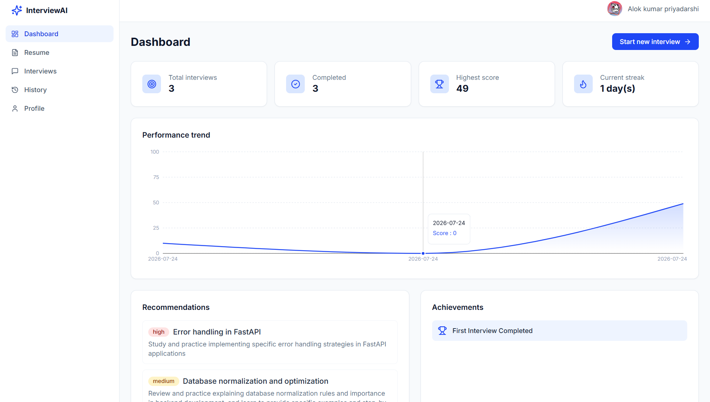
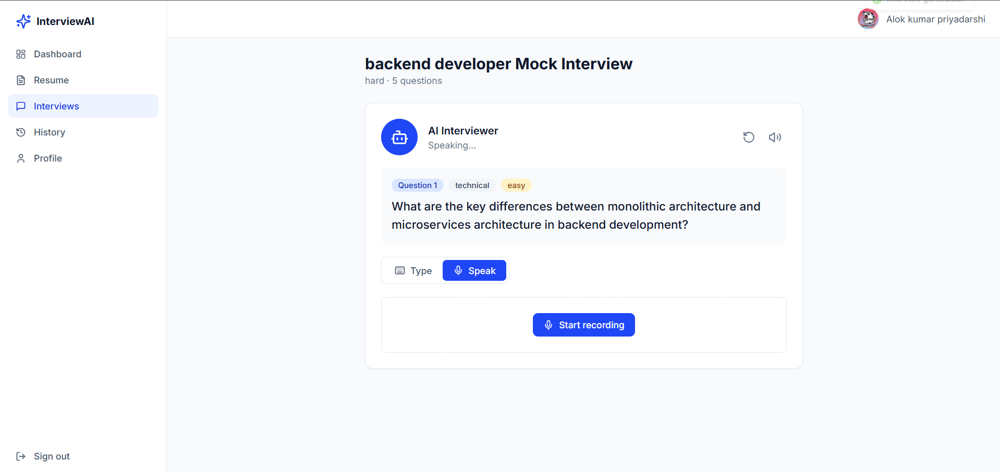
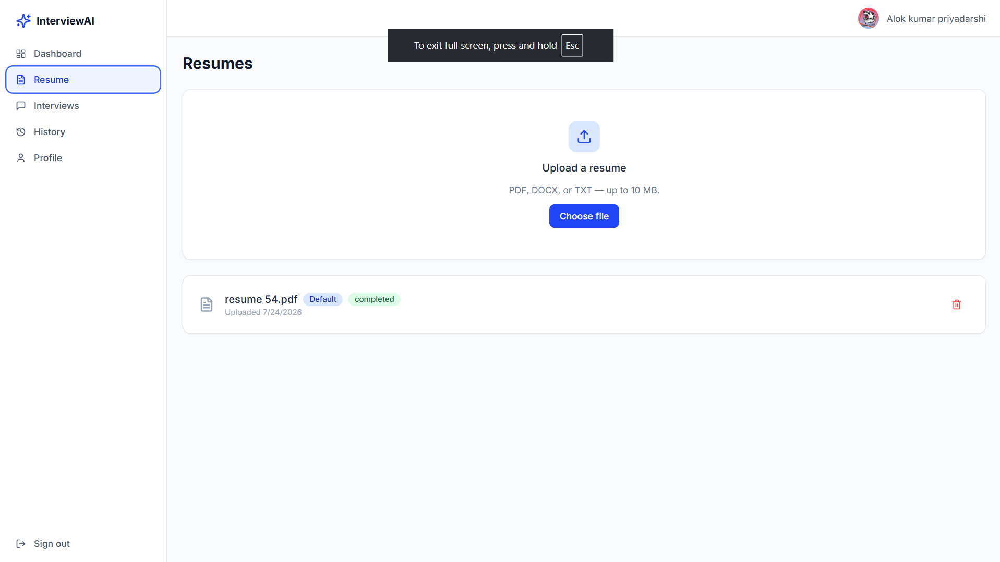
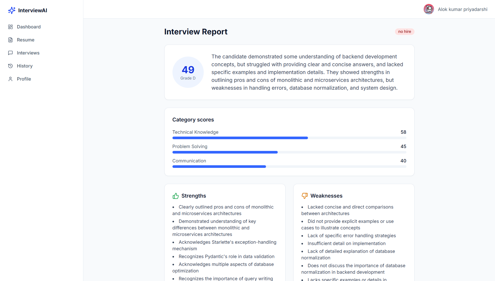
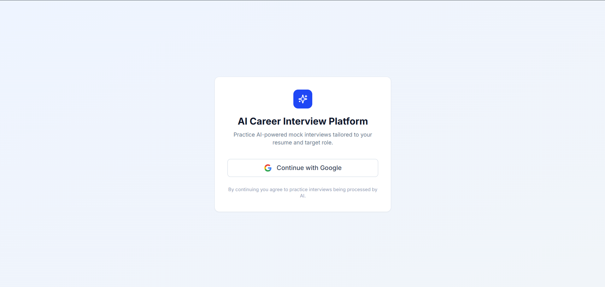
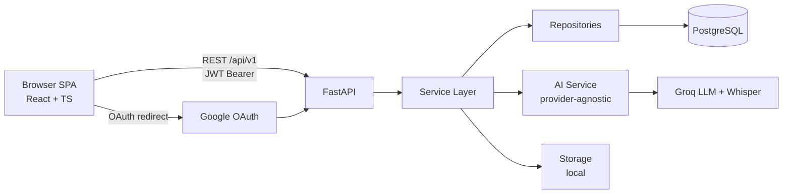

<div align="center">

# 🎙️ AI Career Interview Platform

**Practice mock interviews with an AI interviewer that _talks_ to you.**
Upload your resume → get a tailored interview → answer by **voice or text** →
receive a scored report with strengths, weaknesses, and a personalized plan.


</div>

[🚀 Live Demo Frontend](https://ai-interview-platform-eosin.vercel.app)
<br><br>
[Backend](https://ai-interview-platform-atej.onrender.com)

---

## ✨ Overview

The AI Career Interview Platform is a full-stack, production-grade SaaS
application that simulates realistic job interviews. It analyses your resume
with an LLM, generates role-specific questions, conducts a **conversational
interview** (the interviewer speaks each question aloud), evaluates every answer,
and produces a downloadable PDF report.

## 📸 Screenshots

> Add images to [`images/`](images/) (see [images/README.md](images/README.md)).

| Dashboard | 
| :---: | 
|  |

| Interview (AI interviewer) |
| :--: |
|  | 

| Resume | 
| :---: | 
|  | 

| Report |
| :--: |
|  |


| Login |
| :--: |
|  |

## 🚀 Features

- **Google Sign-In** — OAuth 2.0 with JWT access + refresh tokens (cookieless,
  signed-state CSRF protection).
- **Resume intelligence** — upload PDF / DOCX / TXT; text is extracted and an
  LLM builds a structured candidate profile (skills, experience, education).
- **Career preferences** — target role, experience, salary range, and interview
  preferences drive question generation.
- **AI-generated interviews** — role- and difficulty-aware questions with
  per-question rubrics.
- **🗣️ Conversational experience** — the AI interviewer **greets you and speaks
  each question aloud** (browser Text-to-Speech, voice matched to your
  preference), with replay/mute controls.
- **✍️ / 🎤 Answer by text _or_ voice** — switch per question. Voice answers are
  transcribed with **Groq Whisper**.
- **AI evaluation & reports** — every answer is scored (technical, communication,
  problem-solving); results aggregate into an interview report with a grade,
  hiring recommendation, and a **downloadable PDF**.
- **Dashboard & history** — performance trends (charts), stats, streaks,
  achievements, and searchable interview history.
- **Admin** — platform metrics, user management, and audit logs.

## 🧱 Tech stack

| Layer      | Technology                                                        |
| ---------- | ----------------------------------------------------------------- |
| Frontend   | React · Vite · TypeScript · Tailwind CSS · React Router · Axios · Recharts |
| Backend    | FastAPI · Python · Pydantic · async SQLAlchemy · Alembic |
| Database   | PostgreSQL                                                        |
| AI         | Groq — LLM (Llama 3.3) + Whisper transcription                    |
| Speech     | Whisper    |
| Auth       | Google OAuth 2.0 + JWT                                            |


## 🏗️ Architecture



The backend is a **layered modular monolith**: API → Service → Repository →
Database, with external providers (Groq, Google, storage) behind adapters.


## 🛠️ Getting started

### Prerequisites

- Python **3.13+** (runs on 3.11+), Node **20+**, and a PostgreSQL database.
- Google OAuth credentials and a Groq API key (for auth + AI to work).

### 1. Backend

```bash
cd backend
python -m venv .venv && .venv/Scripts/activate      # Windows
# source .venv/bin/activate                          # macOS/Linux
pip install -r requirements.txt -r requirements-dev.txt
cp .env.example .env.local                           # fill in real values
alembic upgrade head
uvicorn app.main:app --reload                        # http://localhost:8000/docs
pytest                                                # run the test suite
```

### 2. Frontend

```bash
cd frontend
npm install
cp .env.example .env.local                           # set VITE_API_BASE_URL
npm run dev                                           # http://localhost:5173
```

Open **http://localhost:5173** → Continue with Google → upload a resume → start
an interview (sound on!) → view your report.

## 🔐 Configuration

Environment variables are documented in:

- Backend: [`backend/.env.example`](backend/.env.example) (local) ·
  [`backend/.env.dep`](backend/.env.dep) (production template) ·
  [`docs/08-deployment/environment-variables.md`](docs/08-deployment/environment-variables.md)
- Frontend: [`frontend/.env.example`](frontend/.env.example) (local) ·
  [`frontend/.env.dep`](frontend/.env.dep) (production template)

### Google OAuth setup

1. Google Cloud Console → **APIs & Services → Credentials → OAuth client ID**
   (type: Web application).
2. **Authorized redirect URIs**: `http://localhost:8000/api/v1/auth/google/callback`
   (and your production `<BACKEND_URL>/api/v1/auth/google/callback`).
3. On the **OAuth consent screen**, add your account under **Test users**
   (or publish the app).
4. Put the client ID/secret and that redirect URI in `backend/.env`.

> The OAuth callback lands on the **backend**, which then redirects the SPA with
> tokens in the URL fragment — no cross-site cookies, reliable on localhost.

## 📚 API

Base URL `/api/v1`; interactive docs at `/docs` (Swagger) and `/redoc`.
13 groups · 77 routes: Auth, Users, Candidate Profile, Resume, Interviews,
Questions, Answers, Evaluations, Reports, History, Dashboard, Admin, Health.

## 🗺️ Roadmap

- Background workers (async resume/interview/evaluation processing)
- Streaming neural TTS + real-time partial transcription
- Adaptive follow-up questions
- Rate limiting, Sentry monitoring, frontend component tests
