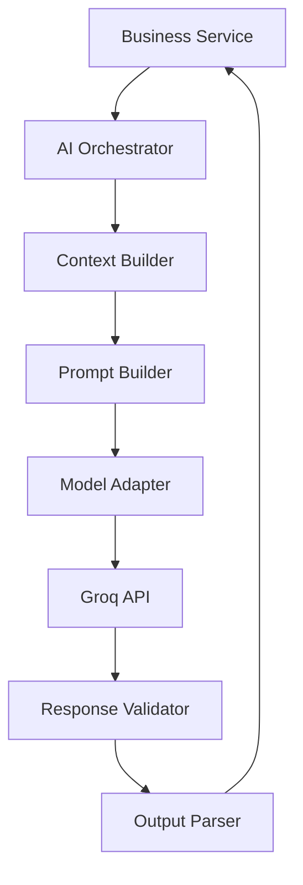
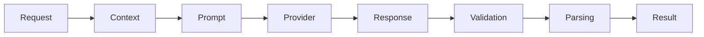

# AI Architecture

**Document ID:** ARC-006

**Version:** 1.0.0

**Status:** Approved

**Priority:** Critical

**Last Updated:** 2026-07-23

---

# Purpose

This document defines the architecture of the AI subsystem used by the AI Career
Interview Platform.

It describes how AI requests are orchestrated, how prompts are constructed,
how structured outputs are validated, and how the application remains
independent of any specific Large Language Model (LLM).

---

# Objectives

The AI subsystem must be:

- Modular
- Provider-independent
- Deterministic
- Observable
- Reliable
- Secure
- Extensible
- Testable

---

# Design Principles

The AI layer follows these principles:

- Business logic never calls an LLM directly.
- Prompts are version controlled.
- Structured JSON responses only.
- Responses are validated before use.
- Retry transient failures.
- Track token usage.
- Keep providers interchangeable.

---

# AI Layer Overview



---

# Responsibilities

The AI subsystem is responsible for:

- Resume analysis
- Candidate profiling
- Interview generation
- Follow-up question generation
- Answer evaluation
- Feedback generation
- Recommendation generation
- Structured output validation

It is **not** responsible for:

- Authentication
- Persistence
- Business workflows
- HTTP routing

---

# Internal Components

```text
AI Orchestrator
│
├── Context Builder
├── Prompt Builder
├── Prompt Registry
├── Model Adapter
├── Response Validator
├── Output Parser
├── Retry Manager
├── Token Tracker
├── Metrics Collector
└── AI Logger
```

---

# AI Orchestrator

The orchestrator coordinates the complete lifecycle of every AI request.

Responsibilities:

- Build execution pipeline
- Select prompt
- Select model
- Invoke provider
- Validate output
- Handle retries
- Return structured result

Every AI request passes through the orchestrator.

---

# Context Builder

The context builder assembles all information required for the prompt.

Possible inputs:

- Resume summary
- Parsed skills
- Candidate profile
- Interview configuration
- Previous questions
- Previous answers
- Conversation history
- Difficulty level
- Target role
- Salary range

Context should contain only relevant information.

---

# Prompt Builder

Responsibilities:

- Load prompt template
- Inject context
- Format instructions
- Define expected output schema

Prompt templates are immutable at runtime.

---

# Prompt Registry

The registry stores all approved prompts.

Examples:

```text
resume_analysis

technical_interview

behavioral_interview

evaluation

feedback

recommendation
```

Each prompt has:

- ID
- Version
- Owner
- Status
- Expected output schema

---

# Model Adapter

The adapter hides provider-specific implementations.

Current provider:

```
Groq
```

Future providers:

```
OpenAI

Claude

Gemini

Ollama

Azure OpenAI
```

Business services never reference provider SDKs.

---

# Response Validator

Every response is validated.

Checks include:

- Valid JSON
- Required fields
- Correct types
- Score limits
- Missing values
- Invalid enums

Invalid responses never reach business logic.

---

# Output Parser

Responsibilities:

- Deserialize JSON
- Convert to typed models
- Normalize values
- Return domain objects

All outputs become strongly typed before use.

---

# Retry Manager

Retries occur only for transient failures.

Examples:

- Timeout
- Network failure
- Invalid JSON
- Temporary provider error

Do not retry:

- Invalid prompts
- Authentication failures
- Unsupported models

Retry attempts should be limited and configurable.

---

# Token Tracker

Track usage for:

- Prompt tokens
- Completion tokens
- Total tokens
- Estimated cost
- Request duration

This supports monitoring and future billing.

---

# Metrics Collector

Collect:

- Latency
- Success rate
- Failure rate
- Retry count
- Validation failures
- Average token usage

Metrics support operational visibility.

---

# AI Logger

Record:

- Request ID
- Prompt ID
- Model
- Duration
- Validation status
- Retry count

Never log:

- Resume contents
- Candidate answers
- Secrets
- API keys

---

# AI Request Lifecycle



---

# Resume Analysis Pipeline

```text
Upload Resume

↓

Extract Text

↓

Normalize Content

↓

Build Resume Context

↓

Resume Analysis Prompt

↓

LLM

↓

Validate JSON

↓

Candidate Profile

↓

Database
```

---

# Interview Generation Pipeline

```text
Candidate Profile

↓

Interview Configuration

↓

Prompt Assembly

↓

LLM

↓

Structured Questions

↓

Validation

↓

Persist Questions
```

---

# Evaluation Pipeline

```text
Question

↓

Candidate Answer

↓

Interview Context

↓

Evaluation Prompt

↓

LLM

↓

JSON Evaluation

↓

Validation

↓

Score Calculation

↓

Feedback
```

---

# Structured Output Contract

Every AI response must conform to a predefined schema.

Example:

```json
{
  "score": 87,
  "strengths": [],
  "weaknesses": [],
  "recommendations": [],
  "confidence": 0.94
}
```

Business services must reject responses that fail schema validation.

---

# Prompt Versioning

Every prompt includes:

- Prompt ID
- Version
- Creation date
- Owner
- Change history

Changing a prompt creates a new version.

Older interview sessions remain associated with the prompt version used.

---

# Provider Independence

The application communicates only with the Model Adapter.

```
Business Service

↓

AI Orchestrator

↓

Model Adapter

↓

Provider
```

Replacing Groq should not require changes outside the adapter.

---

# Failure Handling

Possible failures:

- Provider timeout
- Invalid JSON
- Rate limiting
- Network interruption
- Model unavailable

The orchestrator determines whether to retry or fail gracefully.

---

# Security

The AI subsystem must:

- Protect API keys
- Sanitize prompt inputs
- Validate uploaded content
- Prevent prompt injection where possible
- Avoid exposing internal prompts

Sensitive configuration remains server-side.

---

# Performance

Optimize by:

- Reusing parsed resume context
- Minimizing prompt size
- Avoiding redundant AI calls
- Batching independent evaluations when appropriate

Performance improvements must not reduce evaluation quality.

---

# Future Enhancements

Future capabilities may include:

- Multi-model routing
- Automatic provider fallback
- Prompt experimentation
- Fine-tuned evaluation models
- Retrieval-Augmented Generation (RAG)
- Tool calling
- AI safety scoring
- Cost-aware model selection

The current architecture supports these without redesign.

---

# Related Documents

- `backend-architecture.md`
- `component-architecture.md`
- `authentication-architecture.md`
- `../06-ai-system/`
- `../05-api-contracts/`

---

# Revision History

| Version | Date | Description |
|----------|------|-------------|
| 1.0.0 | 2026-07-23 | Initial AI architecture specification |