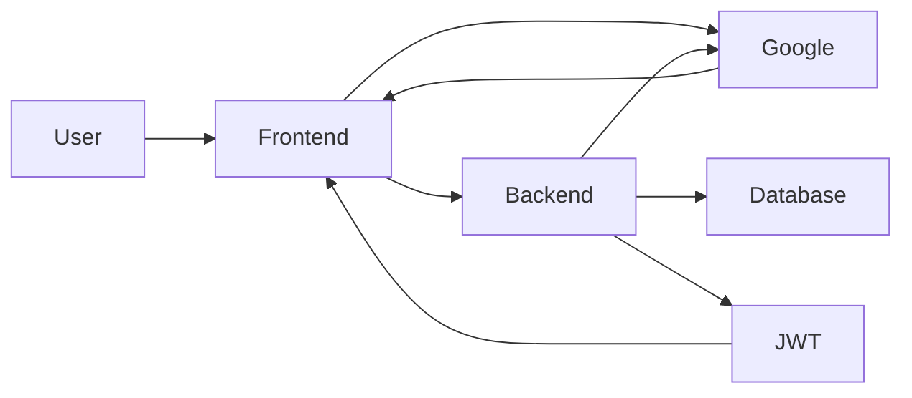
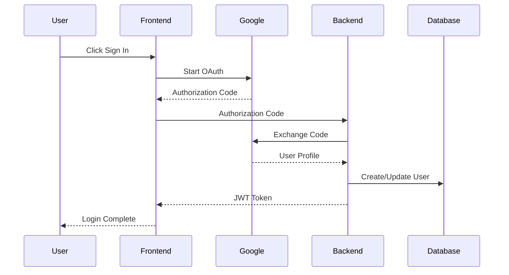
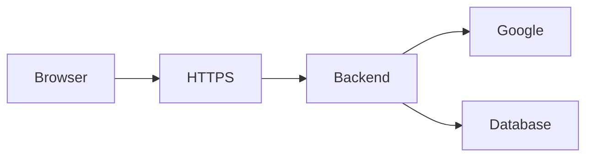

# Authentication Architecture

**Document ID:** ARC-007

**Version:** 1.0.0

**Status:** Approved

**Priority:** Critical

**Last Updated:** 2026-07-23

---

# Purpose

This document defines the authentication and authorization architecture for the
AI Career Interview Platform.

It specifies identity management, session lifecycle, Google OAuth integration,
JWT handling, authorization rules, security boundaries, and protected resource
access.

---

# Objectives

The authentication system must be:

- Secure
- Stateless
- Reliable
- Scalable
- Easy to extend
- Standards compliant
- Provider independent

---

# Authentication Overview

Version 1 supports a single authentication provider:

- Google OAuth 2.0

The backend is responsible for:

- Identity verification
- JWT issuance
- User provisioning
- Authorization
- Session validation

---

# Authentication Flow



---

# Authentication Components

```text
Frontend

├── Login Page
├── Auth Context
├── Protected Routes
└── Token Manager

Backend

├── OAuth Controller
├── Auth Service
├── JWT Service
├── User Service
├── Authorization Service
└── Session Validator
```

---

# Identity Provider

Current Provider:

```
Google OAuth 2.0
```

Responsibilities:

- User authentication
- Identity verification
- Email ownership verification

The application never stores user passwords.

---

# Login Flow



---

# User Provisioning

If the authenticated user does not exist:

1. Create user record
2. Store Google identifier
3. Store verified email
4. Initialize profile
5. Return JWT

Returning users are updated if profile information changes.

---

# JWT Architecture

JWT contains only essential claims.

Example:

```json
{
  "sub": "user_uuid",
  "email": "user@example.com",
  "role": "candidate",
  "iat": 1721680000,
  "exp": 1721683600
}
```

Avoid storing unnecessary user information inside the token.

---

# JWT Lifecycle

```text
Google Login

↓

Issue JWT

↓

Client Stores Token

↓

Authenticated Requests

↓

Expiration

↓

Re-authentication
```

Version 1 does not implement refresh tokens.

---

# Token Validation

Every protected request performs:

```
Receive Token

↓

Verify Signature

↓

Verify Expiration

↓

Extract Claims

↓

Load User

↓

Authorize Request
```

Invalid tokens immediately return **401 Unauthorized**.

---

# Authorization Model

Version 1 supports role-based authorization.

Current roles:

```text
Candidate
```

Reserved future roles:

```text
Admin

Moderator

Support
```

---

# Resource Authorization

Services verify ownership before performing actions.

Examples:

- User accesses only their interviews.
- User accesses only their reports.
- User updates only their profile.
- User uploads only to their account.

Authorization belongs in the service layer.

---

# Protected Resources

Authentication required for:

- Dashboard
- Resume Upload
- Interview Sessions
- Reports
- History
- Profile
- Settings

Public endpoints:

- Login
- Health Check

---

# Frontend Authentication

The frontend manages:

- Login state
- Route protection
- Logout
- Token attachment

Business authorization remains on the backend.

---

# Auth Context

Global authentication state includes:

```text
Authenticated

User

Loading

Login()

Logout()
```

Authentication state is exposed through a dedicated context provider.

---

# Protected Routes

Example:

```text
/

↓

Check Authentication

↓

Authenticated?

↓

Yes → Requested Page

↓

No → Login Page
```

Protected routes improve user experience but do not replace backend validation.

---

# API Authentication

Every protected request includes:

```
Authorization: Bearer <JWT>
```

Requests without a valid token are rejected.

---

# Session Architecture

Version 1 uses stateless JWT sessions.

Advantages:

- Horizontal scalability
- No server-side session storage
- Simple deployment

Session invalidation occurs through:

- Token expiration
- User logout

---

# Logout Flow

```text
User Logout

↓

Remove Local Token

↓

Clear Auth Context

↓

Redirect Login
```

Since JWT is stateless, logout primarily removes client-side credentials.

---

# Security Boundaries



Only the backend communicates with Google APIs.

---

# Security Measures

Authentication architecture enforces:

- HTTPS
- Signed JWTs
- Token expiration
- Input validation
- OAuth verification
- Authorization checks
- Secure configuration

Sensitive secrets remain server-side.

---

# OAuth Credentials

Configuration includes:

- Client ID
- Client Secret
- Redirect URI

Credentials are stored as environment variables.

Never expose the client secret to the frontend.

---

# Error Handling

Common authentication failures:

- Invalid OAuth code
- Expired JWT
- Invalid JWT signature
- Missing Authorization header
- Unauthorized resource access

Errors should return standardized API responses.

---

# Audit Logging

Record:

- Successful logins
- Failed logins
- Logout events
- Authorization failures
- Invalid token attempts

Never log:

- JWT contents
- OAuth tokens
- Client secrets

---

# Future Enhancements

Potential additions:

- Refresh tokens
- Multi-factor authentication (MFA)
- Multiple OAuth providers
- Email verification
- Account linking
- Session revocation
- Device management

The architecture supports these additions without redesign.

---

# Related Documents

- `backend-architecture.md`
- `frontend-architecture.md`
- `high-level-architecture.md`
- `../02-tech-stack/authentication.md`
- `../07-security/`

---

# Revision History

| Version | Date | Description |
|----------|------|-------------|
| 1.0.0 | 2026-07-23 | Initial authentication architecture specification |