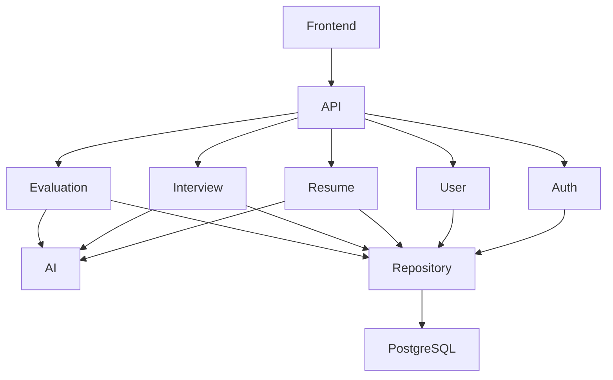

# Component Architecture

**Document ID:** ARC-003

**Version:** 1.0.0

**Status:** Approved

**Priority:** Critical

**Last Updated:** 2026-07-23

---

# Purpose

This document decomposes the AI Career Interview Platform into logical
components.

Each component has:

- A single responsibility
- Defined ownership
- Clear interfaces
- Explicit dependencies
- Well-defined lifecycle

The objective is to ensure every module can be implemented, tested, and
maintained independently.

---

# Design Principles

Every component must follow:

- Single Responsibility Principle
- Dependency Inversion
- Interface-based communication
- No circular dependencies
- Stateless business services where practical
- Explicit ownership of data

---

# Component Hierarchy

```text
Frontend

├── Authentication
├── Dashboard
├── Resume
├── Interview
├── Reports
├── Profile
└── Shared UI

Backend

├── Authentication
├── User
├── Resume
├── Interview
├── Evaluation
├── AI
├── History
├── Analytics
├── File Storage
├── Notification (Future)
└── Administration (Future)
```

---

# Dependency Graph



---

# Frontend Components

---

## Authentication Module

### Responsibilities

- Google Login
- Session handling
- Logout
- Route protection

### Public Interface

- Login Page
- Logout Button
- Auth Provider
- Protected Route

### Depends On

- Backend API
- Google OAuth

---

## Dashboard Module

### Responsibilities

- Overview
- Statistics
- Recent Interviews
- Progress Charts

### Depends On

- User API
- History API
- Analytics API

---

## Resume Module

### Responsibilities

- Upload Resume
- Preview Resume
- Resume Status
- Resume History

### Depends On

- Resume API

---

## Interview Module

### Responsibilities

- Interview Setup
- Question Display
- Timer
- Voice Controls
- Text Answer
- Navigation

### Depends On

- Interview API
- AI API

---

## Reports Module

### Responsibilities

- Scores
- Weak Areas
- Feedback
- Recommendations

### Depends On

- Evaluation API

---

## Profile Module

### Responsibilities

- User Profile
- Preferences
- Interview Settings

---

## Shared UI Module

Contains reusable components:

- Buttons
- Inputs
- Cards
- Dialogs
- Tables
- Loaders
- Icons
- Layouts

---

# Backend Components

---

## Authentication Service

Responsibilities

- Google OAuth
- JWT
- Authorization
- Session validation

Public Methods

- login()
- logout()
- validateToken()

---

## User Service

Responsibilities

- User profile
- Preferences
- Account information

Public Methods

- getUser()
- updateUser()

---

## Resume Service

Responsibilities

- File validation
- Storage
- Parsing
- Resume analysis

Public Methods

- uploadResume()
- parseResume()
- analyzeResume()

Depends On

- AI Service
- Repository

---

## Interview Service

Responsibilities

- Create interviews
- Session lifecycle
- Question sequencing
- Answer collection

Public Methods

- createInterview()
- startInterview()
- submitAnswer()
- finishInterview()

Depends On

- AI Service
- Repository

---

## Evaluation Service

Responsibilities

- AI evaluation
- Score aggregation
- Report generation

Public Methods

- evaluateAnswer()
- generateReport()

Depends On

- AI Service

---

## History Service

Responsibilities

- Previous interviews
- Search
- Filtering

Public Methods

- getHistory()

---

## Analytics Service

Responsibilities

- Progress
- Performance trends
- Skill analytics

Public Methods

- generateStatistics()

---

## AI Service

Responsibilities

- Prompt creation
- Model execution
- Validation
- Retry
- Token accounting

Public Methods

- analyzeResume()
- generateQuestions()
- evaluateAnswer()
- generateFeedback()

Only this component communicates with the LLM.

---

## File Storage Component

Responsibilities

- Resume storage
- Upload validation
- File lifecycle

Future enhancement:

Object storage abstraction.

---

# Repository Components

Each service owns one repository.

Examples:

```
UserRepository

ResumeRepository

InterviewRepository

EvaluationRepository

HistoryRepository
```

Repositories:

- Perform CRUD
- Manage queries
- Handle transactions
- Never contain business rules

---

# AI Internal Components

```text
AI Service

├── Prompt Builder
├── Context Builder
├── Response Validator
├── Retry Handler
├── Token Tracker
├── Model Adapter
└── Output Parser
```

---

## Prompt Builder

Creates prompts from:

- Resume
- Job Role
- Difficulty
- Previous answers
- Conversation history

---

## Context Builder

Builds AI context from:

- Resume summary
- Candidate profile
- Current interview
- Previous questions

---

## Response Validator

Validates:

- JSON structure
- Required fields
- Score ranges
- Hallucination checks

---

## Retry Handler

Retries:

- Timeout
- Invalid JSON
- Temporary provider failures

---

## Model Adapter

Abstracts provider implementation.

Version 1

Groq

Future

OpenAI

Claude

Gemini

Local models

---

# Component Lifecycle

Resume Component

```
Upload

↓

Validate

↓

Store

↓

Parse

↓

Analyze

↓

Persist Profile
```

Interview Component

```
Create

↓

Generate Questions

↓

Start

↓

Answer

↓

Evaluate

↓

Complete

↓

Report
```

---

# Ownership Matrix

| Component | Owner |
|-----------|-------|
| Authentication | Auth Service |
| User | User Service |
| Resume | Resume Service |
| Interview | Interview Service |
| Evaluation | Evaluation Service |
| AI | AI Service |
| Reports | Evaluation Service |
| History | History Service |
| Analytics | Analytics Service |

Each component owns its business rules and persistence.

---

# Communication Rules

Allowed:

```
Frontend

↓

API

↓

Service

↓

Repository
```

Allowed:

```
Service

↓

AI Service
```

Forbidden:

- Frontend → Database
- Controller → Database
- Repository → Repository
- Repository → AI
- Component → External API (except AI Service and Auth Service)

---

# Shared Infrastructure Components

Shared across all modules:

- Logger
- Configuration
- Exception Handler
- Validation
- Security Middleware
- Database Session Manager
- API Response Formatter

These components are infrastructure-only and contain no business logic.

---

# Extensibility

Future components may include:

- Notification Service
- Email Service
- Subscription Service
- Billing Service
- Organization Service
- Admin Portal
- Feature Flag Service
- Background Worker

The architecture supports these additions without modifying existing components.

---

# Quality Constraints

Every component must:

- Be independently testable
- Expose a minimal public interface
- Avoid unnecessary dependencies
- Follow coding standards
- Be documented before implementation

---

# Related Documents

- `high-level-architecture.md`
- `frontend-architecture.md`
- `backend-architecture.md`
- `ai-architecture.md`
- `authentication-architecture.md`

---

# Revision History

| Version | Date | Description |
|----------|------|-------------|
| 1.0.0 | 2026-07-23 | Initial component architecture specification |