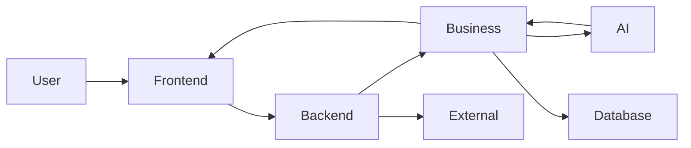
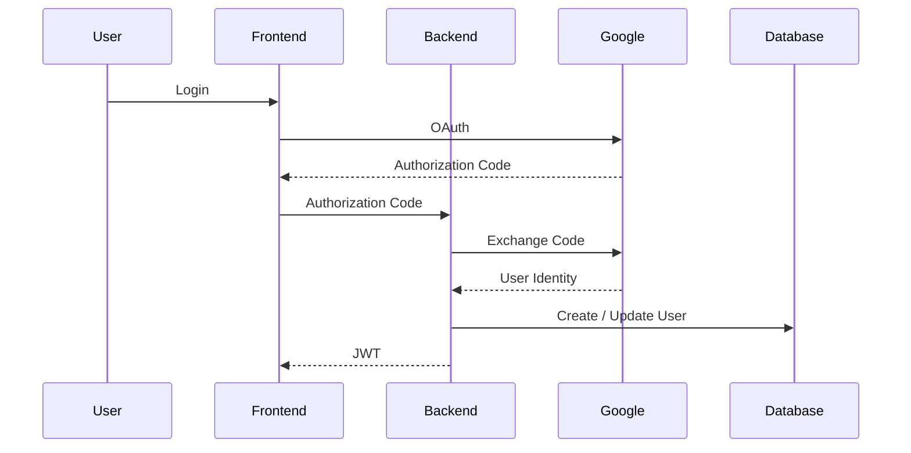
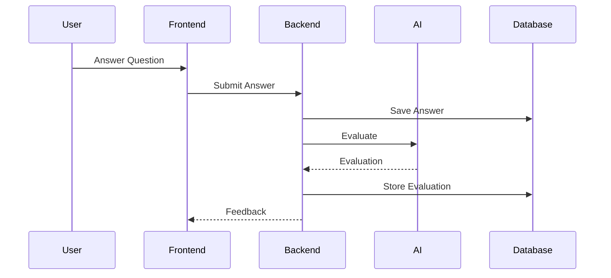
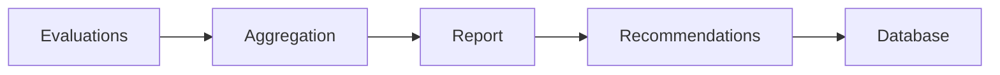

# Data Flow Architecture

**Document ID:** ARC-008

**Version:** 1.0.0

**Status:** Approved

**Priority:** Critical

**Last Updated:** 2026-07-23

---

# Purpose

This document defines how data flows throughout the AI Career Interview
Platform.

It describes:

- Data sources
- Data transformations
- Ownership
- Storage
- External integrations
- AI processing
- Response generation

Every significant user interaction is represented as a data flow.

---

# Objectives

The data flow architecture should ensure:

- Predictable movement of data
- Clear ownership
- No duplicated responsibilities
- Secure handling
- Traceability
- Extensibility

---

# Data Flow Principles

The platform follows these principles:

- Data moves in one direction.
- Every transformation has an owner.
- Raw input is never trusted.
- Validation precedes persistence.
- AI outputs are validated before storage.
- Every stored entity has a source.

---

# High-Level Data Flow



---

# Data Sources

Primary sources:

- User input
- Resume uploads
- Interview answers
- Google OAuth
- AI provider responses

Secondary sources:

- Database
- Configuration
- System metadata

---

# Data Ownership

| Data | Owner |
|------|--------|
| User Profile | User Service |
| Resume | Resume Service |
| Candidate Profile | AI Service |
| Interview | Interview Service |
| Questions | Interview Service |
| Answers | Interview Service |
| Evaluation | Evaluation Service |
| Reports | Evaluation Service |
| Analytics | Analytics Service |

Ownership determines which service may modify the data.

---

# Authentication Flow



---

# Resume Upload Flow

```mermaid
flowchart LR

Resume

Upload

Validation

Storage

Text Extraction

AI Analysis

Candidate Profile

Database

Resume --> Upload

Upload --> Validation

Validation --> Storage

Storage --> Text Extraction

Text Extraction --> AI Analysis

AI Analysis --> Candidate Profile

Candidate Profile --> Database
```

---

# Resume Transformation

```text
PDF / DOCX

↓

Extract Text

↓

Normalize

↓

Structured Resume

↓

AI Analysis

↓

Candidate Profile

↓

Persist
```

The original file and the structured profile are stored independently.

---

# Interview Creation Flow

```mermaid
flowchart LR

User

Configuration

Interview Service

AI

Questions

Database

User --> Configuration

Configuration --> Interview Service

Interview Service --> AI

AI --> Questions

Questions --> Database
```

---

# Interview Session Flow



---

# Voice Interview Flow

```text
Microphone

↓

Audio Recording

↓

Upload

↓

Speech-to-Text

↓

Transcript

↓

Evaluation

↓

Feedback
```

Speech processing occurs before evaluation.

---

# AI Processing Flow

```mermaid
flowchart TB

Context

Prompt

Provider

Response

Validation

Parser

Domain Object

Context --> Prompt

Prompt --> Provider

Provider --> Response

Response --> Validation

Validation --> Parser

Parser --> Domain Object
```

---

# Evaluation Flow

```text
Question

↓

Candidate Answer

↓

Interview Context

↓

Evaluation Prompt

↓

LLM

↓

JSON Response

↓

Validation

↓

Evaluation Object

↓

Persist
```

---

# Report Generation Flow



---

# Dashboard Flow

```text
User

↓

Dashboard Request

↓

History Service

↓

Analytics Service

↓

Database

↓

Statistics

↓

Frontend
```

Dashboard data is derived from persisted interview history.

---

# Data Validation Pipeline

Every incoming request follows:

```text
Receive

↓

Schema Validation

↓

Business Validation

↓

Authorization

↓

Persistence Validation

↓

Store
```

AI responses undergo an additional validation stage before use.

---

# Persistence Flow

```text
Business Service

↓

Repository

↓

Transaction

↓

Database

↓

Commit

↓

Return Entity
```

Repositories never perform business transformations.

---

# External Service Communication

Current integrations:

| Service | Direction |
|----------|-----------|
| Google OAuth | Bidirectional |
| Groq API | Bidirectional |
| Whisper | Bidirectional |

All external communication uses HTTPS.

---

# Error Flow

```text
Failure

↓

Exception

↓

Exception Handler

↓

Standard API Response

↓

Frontend Notification
```

Errors should propagate upward without exposing internal implementation details.

---

# Logging Flow

Each request records:

```text
Request

↓

Request ID

↓

Business Event

↓

Response Status

↓

Metrics
```

Sensitive payloads are never logged.

---

# Data Lifecycle

Resume

```text
Upload

↓

Validation

↓

Storage

↓

Analysis

↓

Usage

↓

Archive
```

Interview

```text
Create

↓

Generate

↓

Execute

↓

Evaluate

↓

Report

↓

History
```

---

# Data Retention

Persisted entities include:

- Users
- Resumes
- Candidate Profiles
- Interviews
- Questions
- Answers
- Evaluations
- Reports

Temporary processing artifacts should be removed after successful completion.

---

# Security Boundaries

Data crossing trust boundaries must be:

- Authenticated
- Authorized
- Validated
- Sanitized
- Logged appropriately

Trust boundaries include:

- Browser ↔ Backend
- Backend ↔ Google
- Backend ↔ AI Provider

---

# Future Data Flows

Future versions may introduce:

- Background processing
- Message queues
- Object storage
- AI provider fallback
- Analytics pipelines
- Event streaming

These additions should extend, not replace, the existing flow architecture.

---

# Related Documents

- `system-overview.md`
- `high-level-architecture.md`
- `backend-architecture.md`
- `ai-architecture.md`
- `sequence-diagrams.md`

---

# Revision History

| Version | Date | Description |
|----------|------|-------------|
| 1.0.0 | 2026-07-23 | Initial data flow architecture specification |