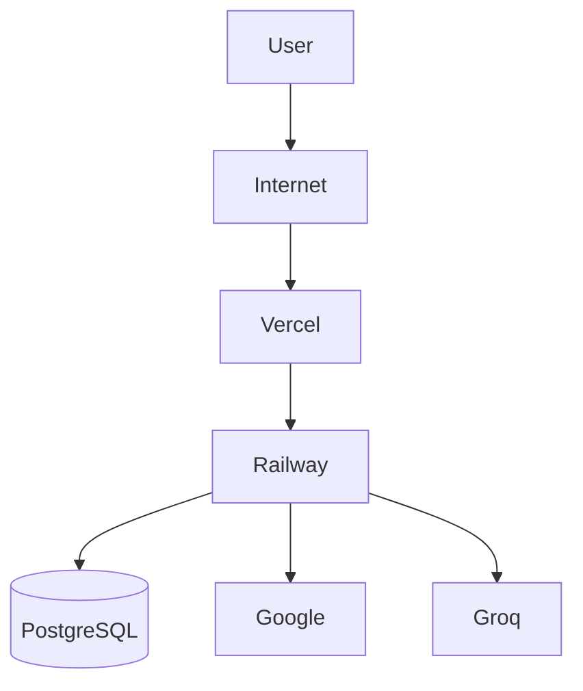
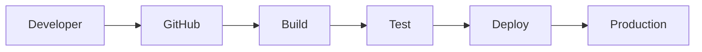

# Deployment Architecture

**Document ID:** ARC-010

**Version:** 1.0.0

**Status:** Approved

**Priority:** Critical

**Last Updated:** 2026-07-23

---

# Purpose

This document defines the deployment architecture of the AI Career Interview
Platform.

It specifies infrastructure topology, networking, deployment boundaries,
external integrations, CI/CD flow, monitoring, backup strategy, and operational
guidelines for Version 1.

---

# Objectives

The deployment architecture should be:

- Secure
- Highly available
- Easy to deploy
- Easy to monitor
- Easy to recover
- Environment isolated
- Cloud-native

---

# Deployment Overview

Version 1 consists of:

- React Frontend
- FastAPI Backend
- PostgreSQL Database
- Google OAuth
- Groq API

Deployment targets:

- Frontend → Vercel
- Backend → Railway
- Database → Railway PostgreSQL

---

# Production Topology



---

# Infrastructure Components

## Frontend

Platform:

Vercel

Responsibilities:

- Static asset hosting
- React application
- CDN distribution
- HTTPS termination

---

## Backend

Platform:

Railway

Responsibilities:

- FastAPI application
- Authentication
- Business logic
- AI orchestration
- API endpoints

---

## Database

Platform:

Railway PostgreSQL

Responsibilities:

- User data
- Resume metadata
- Interviews
- Evaluations
- Reports
- Analytics

---

# Deployment Boundaries

```text
Browser

↓

Internet

↓

Frontend

↓

Backend

↓

Database
```

External providers:

- Google OAuth
- Groq API

Only the backend communicates with external APIs.

---

# Networking

All communication uses HTTPS.

```text
Browser

↓

HTTPS

↓

Frontend

↓

HTTPS

↓

Backend

↓

HTTPS

↓

External Services
```

Database communication remains private within Railway networking.

---

# Environment Isolation

Each environment has independent resources.

```text
Development

↓

Testing

↓

Staging

↓

Production
```

Each environment owns:

- Database
- Secrets
- OAuth credentials
- API configuration

---

# Environment Variables

Backend configuration includes:

```
DATABASE_URL

JWT_SECRET

GROQ_API_KEY

GOOGLE_CLIENT_ID

GOOGLE_CLIENT_SECRET

FRONTEND_URL

BACKEND_URL

LOG_LEVEL
```

Frontend configuration includes:

```
VITE_API_BASE_URL

VITE_GOOGLE_CLIENT_ID
```

Sensitive values remain backend-only.

---

# CI/CD Pipeline



Deployment occurs only after successful builds and tests.

---

# Release Flow

```text
Feature Branch

↓

Pull Request

↓

Code Review

↓

Merge

↓

CI Pipeline

↓

Deploy
```

Every deployment is reproducible from source control.

---

# Database Migrations

Migration workflow:

```text
Deploy

↓

Run Alembic Migration

↓

Health Check

↓

Application Ready
```

Schema changes are version-controlled.

---

# Health Checks

Required endpoints:

```
GET /health

GET /ready

GET /live
```

These endpoints should not require authentication.

---

# Monitoring

Monitor:

- API latency
- Error rate
- AI latency
- Database availability
- Memory usage
- CPU usage
- Request volume

Operational metrics should be collected continuously.

---

# Logging

Application logs should include:

- Request ID
- Timestamp
- Endpoint
- Status code
- Duration
- Error context

Never log:

- Passwords
- JWTs
- API keys
- OAuth tokens

---

# Backup Strategy

Back up:

- PostgreSQL database
- Configuration templates
- Migration history

Backups should be encrypted and periodically verified through restoration testing.

---

# Disaster Recovery

Recovery priorities:

1. Restore database
2. Restore backend
3. Restore frontend
4. Validate integrations
5. Verify health checks

Document recovery procedures separately in the operations runbook.

---

# Security

Production deployment must enforce:

- HTTPS
- Secure headers
- Environment-based secrets
- JWT validation
- OAuth verification
- Database encryption in transit

No secrets should be embedded in source code.

---

# Scaling Strategy

Version 1:

- Single backend instance
- Single PostgreSQL instance

Future:

- Multiple backend instances
- Read replicas
- Redis cache
- Background workers
- CDN optimization

The deployment architecture supports incremental scaling.

---

# Rollback Strategy

Rollback procedure:

```text
Detect Failure

↓

Stop Deployment

↓

Restore Previous Release

↓

Run Health Checks

↓

Resume Traffic
```

Database rollbacks should follow Alembic migration policies.

---

# Operational Checklist

Before every production deployment:

- Build succeeds
- Tests pass
- Database migration reviewed
- Secrets verified
- Health endpoints operational
- Monitoring enabled
- Backups confirmed

---

# Future Enhancements

Potential infrastructure improvements:

- Docker
- Kubernetes
- Redis
- Object Storage
- CDN image optimization
- Background job processing
- Multi-region deployment

These enhancements are outside the scope of Version 1.

---

# Related Documents

- `backend-architecture.md`
- `deployment-stack.md`
- `environment-management.md`
- `fault-tolerance.md`
- `scalability.md`

---

# Revision History

| Version | Date | Description |
|----------|------|-------------|
| 1.0.0 | 2026-07-23 | Initial deployment architecture specification |