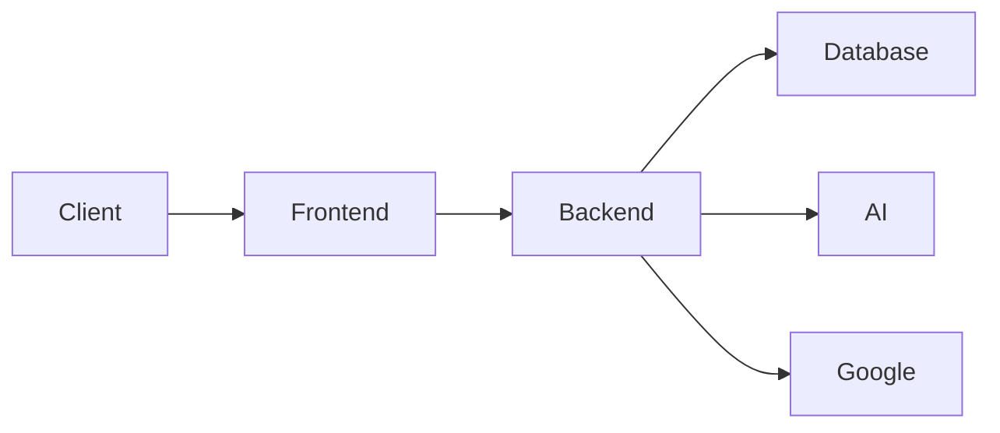
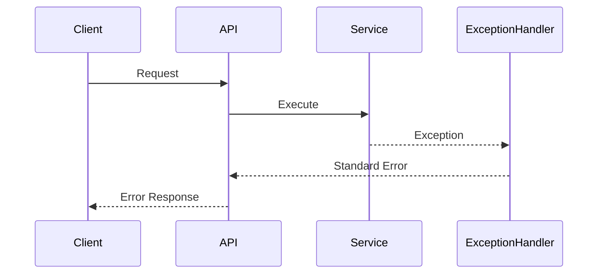

# Fault Tolerance Architecture

**Document ID:** ARC-012

**Version:** 1.0.0

**Status:** Approved

**Priority:** Critical

**Last Updated:** 2026-07-23

---

# Purpose

This document defines the fault tolerance strategy for the AI Career Interview
Platform.

It describes how the platform detects failures, isolates faults, retries
recoverable operations, degrades gracefully, and recovers from unexpected
system failures while protecting user data.

---

# Objectives

The platform should:

- Continue operating during partial failures
- Prevent cascading failures
- Recover automatically where possible
- Preserve data integrity
- Minimize downtime
- Provide clear user feedback
- Support operational recovery

---

# Fault Tolerance Principles

The platform follows these principles:

- Assume every dependency can fail.
- Fail fast when recovery is impossible.
- Retry only transient failures.
- Prevent cascading failures.
- Keep failures isolated.
- Never lose committed data.
- Prefer graceful degradation over total outage.

---

# Failure Domains

Major failure domains include:

- Browser
- Frontend Hosting
- Backend API
- Database
- AI Provider
- Google OAuth
- Network
- Storage
- Deployment Pipeline

Failures in one domain should not unnecessarily affect others.

---

# Failure Classification

| Failure Type | Example | Strategy |
|--------------|---------|----------|
| Transient | Network timeout | Retry |
| Temporary | AI provider unavailable | Retry + Degrade |
| Persistent | Invalid configuration | Fail Fast |
| External | OAuth outage | Graceful Error |
| Internal | Database failure | Recovery Procedure |

---

# System Failure Model



Each component independently detects and reports failures.

---

# Failure Detection

Failures are detected through:

- HTTP status codes
- Timeouts
- Health checks
- Exception handling
- Database connectivity checks
- AI response validation
- Monitoring alerts

Detection should occur as early as possible.

---

# Graceful Degradation

If an optional service becomes unavailable, the platform should continue
providing core functionality.

Examples:

AI temporarily unavailable:

- Resume upload accepted
- Analysis queued or deferred
- User notified

Analytics unavailable:

- Dashboard loads without analytics

Notification service unavailable:

- Interview continues normally

---

# Retry Policy

Retries apply only to transient failures.

Retry candidates:

- Network timeout
- Temporary AI provider failure
- Temporary database connection failure

Do not retry:

- Validation errors
- Authentication failures
- Authorization failures
- Malformed requests

Retry count should be configurable and bounded.

---

# Timeout Strategy

Every external dependency requires explicit timeouts.

Examples:

| Component | Timeout |
|-----------|---------|
| AI Provider | Configurable |
| Google OAuth | Configurable |
| Database Query | Configurable |
| HTTP Client | Configurable |

No external request should wait indefinitely.

---

# Circuit Breaker

Future versions may introduce a circuit breaker around external providers.

```text
Closed

↓

Failures Increase

↓

Open

↓

Cooldown

↓

Half-Open

↓

Healthy?

↓

Closed
```

This prevents repeated requests to failing services.

---

# AI Provider Failure

Possible failures:

- Timeout
- Rate limiting
- Invalid response
- Service outage

Recovery options:

- Retry
- Return temporary error
- Queue background processing
- Route to alternate provider (future)

---

# Database Failure

Possible failures:

- Connection loss
- Migration issue
- Storage exhaustion

Recovery:

- Reject writes safely
- Preserve request context
- Alert operators
- Restore from backup if necessary

Never acknowledge writes that were not committed.

---

# OAuth Failure

Possible scenarios:

- Google unavailable
- Invalid authorization code
- Token verification failure

Expected behavior:

- Reject login
- Preserve existing authenticated sessions
- Return standardized authentication error

---

# API Failure Handling



All unexpected exceptions pass through a centralized exception handler.

---

# Data Integrity

The platform protects data by:

- Using database transactions
- Rolling back failed writes
- Validating before persistence
- Avoiding partial updates

Every write operation should be atomic.

---

# Idempotency

Operations that may be retried should be idempotent where possible.

Examples:

- Resume upload initialization
- Interview creation request
- Report retrieval

Repeated requests should not create duplicate resources.

---

# Logging During Failures

Every failure log should include:

- Timestamp
- Request ID
- Component
- Error type
- Correlation ID
- Stack trace (internal only)

Never log:

- API keys
- JWTs
- OAuth tokens
- Sensitive user content

---

# Monitoring and Alerting

Critical alerts include:

- Database unavailable
- AI provider outage
- Authentication failures
- Elevated error rate
- High latency
- Failed deployments

Alerts should include enough context for rapid diagnosis.

---

# Recovery Strategy

Recovery sequence:

```text
Detect Failure

↓

Isolate Fault

↓

Recover Automatically

↓

Verify Health

↓

Resume Normal Operation
```

Manual intervention should be required only when automatic recovery fails.

---

# Backup Strategy

Back up:

- PostgreSQL database
- Migration history
- Infrastructure configuration
- Environment templates

Backups should be:

- Encrypted
- Tested
- Versioned
- Retained according to policy

---

# Disaster Recovery

Recovery priorities:

1. Restore database
2. Restore backend
3. Restore frontend
4. Restore external integrations
5. Verify health endpoints
6. Resume user traffic

Recovery procedures should be documented and periodically rehearsed.

---

# Operational Readiness

Before production:

- Health checks implemented
- Monitoring enabled
- Alerts configured
- Backups verified
- Rollback tested
- Incident response documented

---

# Future Enhancements

Future resilience improvements include:

- Multi-region deployment
- Database replication
- AI provider failover
- Distributed circuit breakers
- Chaos testing
- Self-healing infrastructure
- Automatic traffic shifting

These enhancements build upon the Version 1 architecture without major redesign.

---

# Related Documents

- `deployment-architecture.md`
- `scalability.md`
- `backend-architecture.md`
- `authentication-architecture.md`
- `../07-security/`

---

# Revision History

| Version | Date | Description |
|----------|------|-------------|
| 1.0.0 | 2026-07-23 | Initial fault tolerance architecture specification |