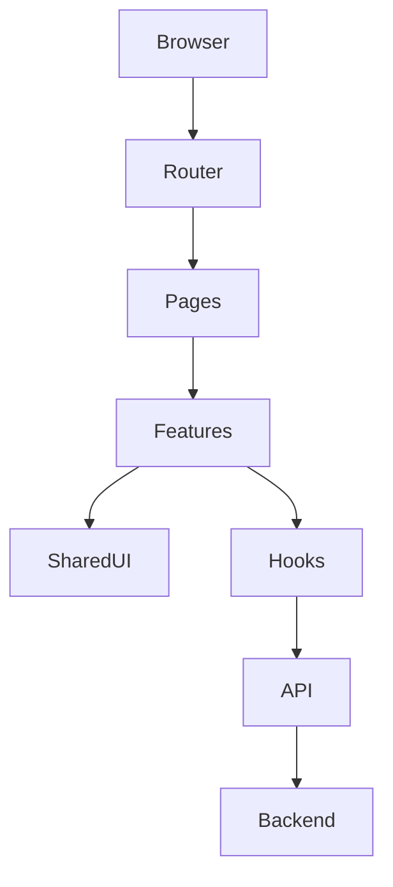

# Frontend Architecture

**Document ID:** ARC-004

**Version:** 1.0.0

**Status:** Approved

**Priority:** Critical

**Last Updated:** 2026-07-23

---

# Purpose

This document defines the architecture of the React frontend for the AI Career
Interview Platform.

It specifies application structure, routing, state management, rendering
strategy, communication patterns, UI composition, and frontend design rules.

---

# Goals

The frontend architecture is designed to be:

- Modular
- Type-safe
- Accessible
- Responsive
- Performant
- Easy to extend
- Easy to test
- Feature-oriented

---

# Technology Stack

| Technology | Purpose |
|------------|---------|
| React | UI Framework |
| TypeScript | Static typing |
| Vite | Build tool |
| React Router | Client-side routing |
| Tailwind CSS | Styling |
| Axios | API communication |
| Context API | Global application state |

---

# High-Level Architecture



---

# Directory Structure

```text
frontend/
│
├── src/
│   ├── app/
│   ├── routes/
│   ├── layouts/
│   ├── pages/
│   ├── features/
│   ├── components/
│   ├── hooks/
│   ├── services/
│   ├── contexts/
│   ├── utils/
│   ├── types/
│   ├── assets/
│   └── styles/
```

Each directory has a single responsibility.

---

# Feature-Based Organization

Features own their implementation.

Example:

```text
features/

authentication/

resume/

interview/

evaluation/

history/

dashboard/

profile/
```

Each feature contains:

- Components
- Hooks
- API calls
- Types
- Utilities
- Validation

---

# Application Layers

```
Pages

↓

Feature Components

↓

Shared Components

↓

Hooks

↓

API Service

↓

Backend
```

Business rules remain on the backend.

---

# Routing

React Router manages navigation.

Primary routes:

```
/

/login

/dashboard

/profile

/resume

/interview

/interview/:id

/report/:id

/history

/settings

/not-found
```

Protected routes require authentication.

---

# Layout Structure

Layouts provide shared UI.

Examples:

```
PublicLayout

AuthenticatedLayout
```

Authenticated layout contains:

- Navigation
- Sidebar
- Header
- Footer
- Notification Area

---

# Component Hierarchy

```
Page

↓

Feature Component

↓

Reusable Component

↓

Primitive UI Component
```

Example:

```
InterviewPage

↓

InterviewPanel

↓

QuestionCard

↓

Button
```

---

# Component Categories

## Pages

Represent routes.

Example:

```
DashboardPage
```

---

## Feature Components

Contain feature-specific UI.

Example:

```
InterviewPanel
```

---

## Shared Components

Reusable components.

Examples:

- Button
- Modal
- Input
- Card
- Badge
- Table
- Spinner

---

## Layout Components

Examples:

- Sidebar
- Navbar
- Footer
- Header

---

# State Management

Global state is intentionally minimal.

Managed globally:

- Authentication
- User Profile
- Theme (Future)
- Notifications

Local state remains inside features whenever possible.

---

# Context Providers

```
AuthProvider

NotificationProvider
```

Future:

```
ThemeProvider
```

---

# Data Fetching

API requests use Axios.

Flow:

```
Component

↓

Hook

↓

API Service

↓

Backend
```

Components never call Axios directly.

---

# API Layer

Example structure:

```text
services/

api/

authApi.ts

resumeApi.ts

interviewApi.ts

evaluationApi.ts
```

Responsibilities:

- HTTP requests
- Response parsing
- Error mapping

---

# Custom Hooks

Business interaction belongs inside hooks.

Examples:

```
useAuth()

useResume()

useInterview()

useEvaluation()

useHistory()
```

Hooks coordinate API calls and local UI state.

---

# Rendering Strategy

The application uses client-side rendering.

Advantages:

- Interactive interviews
- Low infrastructure complexity
- Fast development

Future server-side rendering can be introduced if SEO requirements emerge.

---

# Error Handling

Error boundaries should protect major sections.

Suggested boundaries:

- Application
- Dashboard
- Interview
- Reports

API errors should display user-friendly messages.

---

# Loading States

Every asynchronous operation should provide:

- Loading indicator
- Disabled actions
- Retry option (where applicable)

Avoid blank screens.

---

# Form Management

Forms should provide:

- Client-side validation
- Inline error messages
- Accessible labels
- Clear submission states

Server validation remains authoritative.

---

# File Upload Flow

```
Select File

↓

Validate

↓

Upload

↓

Processing

↓

Complete
```

Progress indicators should be shown during uploads.

---

# Voice Interview Flow

```
Microphone Permission

↓

Recording

↓

Upload Audio

↓

Speech-to-Text

↓

Answer Display
```

Frontend manages recording only.

Speech processing remains backend-controlled.

---

# Accessibility

All UI must support:

- Keyboard navigation
- Focus indicators
- Semantic HTML
- ARIA attributes where necessary
- Screen readers
- Color contrast compliance

Accessibility is a default requirement.

---

# Performance Strategy

Apply:

- Code splitting
- Lazy-loaded routes
- Memoization where justified
- Image optimization
- Debounced search inputs

Avoid premature optimization.

---

# Styling Guidelines

Tailwind CSS is the primary styling system.

Guidelines:

- Utility-first approach
- Consistent spacing scale
- Responsive breakpoints
- Minimal custom CSS

Shared design tokens should be centralized.

---

# Security

Frontend responsibilities include:

- Token storage policy
- Route protection
- Input validation
- Output escaping
- HTTPS communication only

Sensitive validation always occurs on the backend.

---

# Testing Strategy

Frontend testing includes:

- Component tests
- Hook tests
- Route tests
- Accessibility checks

Business logic should not exist in components.

---

# Future Enhancements

Potential additions:

- Dark mode
- Internationalization
- Offline support
- Push notifications
- Real-time collaboration

These should integrate without restructuring the existing architecture.

---

# Related Documents

- `component-architecture.md`
- `backend-architecture.md`
- `authentication-architecture.md`
- `high-level-architecture.md`

---

# Revision History

| Version | Date | Description |
|----------|------|-------------|
| 1.0.0 | 2026-07-23 | Initial frontend architecture specification |