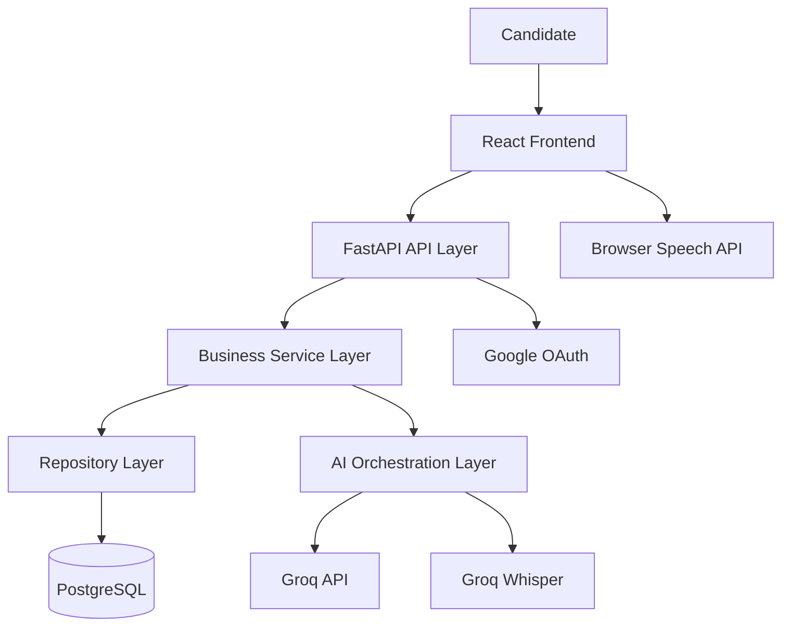
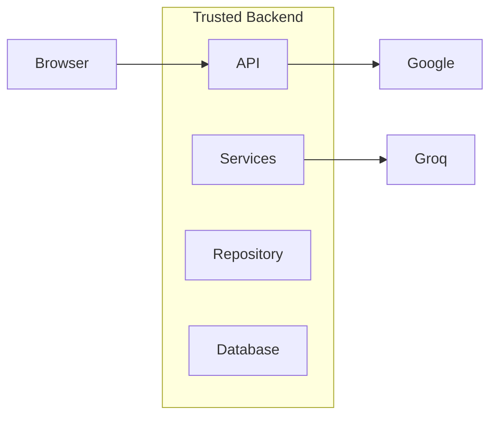

# High-Level Architecture

**Document ID:** ARC-002

**Version:** 1.0.0

**Status:** Approved

**Priority:** Critical

**Last Updated:** 2026-07-23

---

# Purpose

This document defines the logical architecture of the AI Career Interview
Platform.

It describes the major architectural layers, subsystem decomposition,
communication paths, trust boundaries, external integrations, and design
principles that govern the entire application.

This document is the primary architectural blueprint for implementation.

---

# Architectural Goals

The architecture is designed to achieve:

- High maintainability
- Clear separation of concerns
- Strong modularity
- Scalability
- Security
- Testability
- AI provider independence
- Documentation-driven development

---

# Architecture Style

The application follows a **Layered Modular Monolith** architecture.

Version 1 intentionally avoids microservices while keeping internal
modules loosely coupled.

Advantages:

- Simple deployment
- Lower operational overhead
- Easier debugging
- Faster development
- Clear ownership
- Easier onboarding

Future migration to microservices remains possible through module boundaries.

---

# Logical Architecture



---

# Layer Responsibilities

## Presentation Layer

Technology

- React
- TypeScript
- Tailwind CSS

Responsibilities

- UI
- Forms
- Navigation
- Authentication flow
- Voice controls
- Interview interface
- Reports

The frontend contains no business logic.

---

## API Layer

Technology

FastAPI

Responsibilities

- Authentication
- Authorization
- Validation
- Routing
- Request parsing
- Response formatting

Business logic is prohibited in this layer.

---

## Business Service Layer

Responsibilities

- Interview lifecycle
- Resume lifecycle
- Evaluation workflow
- User management
- Report generation

This is the application's core.

---

## AI Orchestration Layer

Responsibilities

- Prompt construction
- Resume context assembly
- Conversation history
- Model selection
- Retry handling
- Validation
- Cost tracking

No other module communicates directly with an LLM.

---

## Repository Layer

Responsibilities

- CRUD
- Query optimization
- Persistence abstraction

Repositories isolate SQLAlchemy from business logic.

---

## Persistence Layer

Technology

PostgreSQL

Responsibilities

- Data persistence
- Transactions
- Constraints
- Indexes
- Relationships

---

# Subsystem Decomposition

The platform is divided into the following bounded modules.

```
Authentication

User

Resume

Interview

Evaluation

History

Profile

AI

Reporting

Administration (Future)
```

Each subsystem owns its own models, services, repositories, and APIs.

---

# Internal Dependency Rules

Allowed dependency direction:

```
Frontend

↓

API

↓

Services

↓

Repositories

↓

Database
```

AI interactions:

```
Services

↓

AI Layer

↓

LLM
```

Repositories never call services.

Frontend never accesses databases.

Controllers never invoke repositories directly.

---

# Module Ownership

| Module | Responsibility |
|---------|----------------|
| Authentication | Identity and access |
| User | User profile management |
| Resume | Resume ingestion and parsing |
| Interview | Session orchestration |
| Evaluation | AI-based scoring |
| History | Previous interviews |
| AI | Prompt orchestration |
| Reporting | Reports and analytics |

---

# Trust Boundaries



Everything outside the backend is considered an external trust boundary.

---

# External Integrations

## Google OAuth

Responsibilities

- User authentication

Communication

HTTPS

---

## Groq API

Responsibilities

- Question generation
- Resume analysis
- Evaluation
- Feedback

Communication

HTTPS

---

## Browser APIs

Responsibilities

- Speech synthesis
- Media recording

---

# Request Processing Pipeline


---

# AI Processing Pipeline


---

# Communication Principles

Subsystems communicate through:

- Service interfaces
- Repository interfaces
- Typed models
- DTOs

Avoid:

- Shared mutable state
- Direct SQL across modules
- Cross-module model mutations

---

# Data Ownership

Each module owns its own entities.

Example

Interview module owns:

- Interview
- Question
- Answer

Evaluation module owns:

- Evaluation
- Feedback
- Scores

No module modifies another module's persistence directly.

---

# Error Propagation

Errors move upward only.

```
Database

↓

Repository

↓

Service

↓

API

↓

Frontend
```

Each layer may enrich the error but should preserve its context.

---

# Security Boundaries

Security is enforced at multiple levels:

Frontend

- Route guards

API

- JWT validation

Business

- Authorization checks

Database

- Constraints

Infrastructure

- HTTPS
- Environment secrets

---

# Scalability Strategy

Version 1

- Single backend instance
- Single PostgreSQL database
- Stateless APIs

Future

- Multiple backend instances
- Redis
- Object storage
- Background workers
- Read replicas

The modular architecture minimizes future migration effort.

---

# Cross-Cutting Concerns

Applied consistently across every subsystem:

- Logging
- Configuration
- Error handling
- Validation
- Authentication
- Authorization
- Monitoring
- Documentation

No module should implement these independently.

---

# Design Constraints

Version 1 intentionally excludes:

- Microservices
- Event buses
- Message queues
- Distributed transactions
- Service mesh
- Kubernetes

These can be introduced later without restructuring the domain model.

---

# Architecture Quality Attributes

The architecture prioritizes:

- Maintainability
- Reliability
- Simplicity
- Modularity
- Extensibility
- Security
- Performance
- Observability

Trade-offs favor developer productivity over premature optimization.

---

# Traceability

This architecture satisfies:

- Functional Requirements (FR)
- Non-Functional Requirements (NFR)
- Business Rules (BR)

Every component described here must map to implementation artifacts in later phases.

---

# Related Documents

- `system-overview.md`
- `component-architecture.md`
- `frontend-architecture.md`
- `backend-architecture.md`
- `ai-architecture.md`
- `deployment-architecture.md`

---

# Revision History

| Version | Date | Description |
|----------|------|-------------|
| 1.0.0 | 2026-07-23 | Initial high-level architecture |