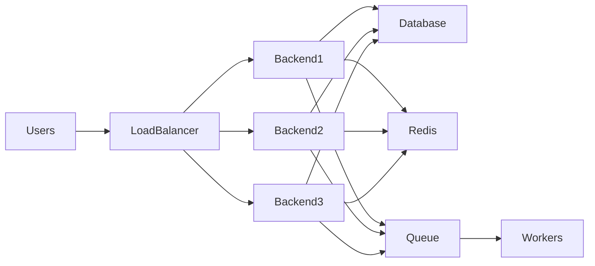

# Scalability Architecture

**Document ID:** ARC-011

**Version:** 1.0.0

**Status:** Approved

**Priority:** High

**Last Updated:** 2026-07-23

---

# Purpose

This document defines the scalability strategy for the AI Career Interview
Platform.

It describes how the platform evolves from a simple deployment in Version 1
into a highly scalable production system capable of supporting thousands of
concurrent users without significant architectural changes.

---

# Objectives

The platform should:

- Scale horizontally
- Scale vertically when appropriate
- Minimize infrastructure cost
- Maintain high availability
- Isolate bottlenecks
- Support future distributed services
- Preserve data consistency

---

# Scalability Principles

The architecture follows these principles:

- Scale stateless services first.
- Keep services independent.
- Avoid shared mutable state.
- Use asynchronous processing where beneficial.
- Cache frequently accessed data.
- Keep scaling transparent to users.
- Design for incremental evolution.

---

# Scalability Roadmap

| Stage | Target Users | Architecture |
|---------|-------------:|-------------|
| V1 | 100–500 | Single Backend Instance |
| V2 | 5,000 | Multiple Backend Instances |
| V3 | 20,000 | Load Balanced Cluster |
| V4 | 100,000+ | Distributed Services |

---

# High-Level Scaling Strategy



---

# Frontend Scaling

Frontend is hosted on Vercel.

Benefits include:

- Global CDN
- Edge caching
- Automatic scaling
- Static asset optimization
- Geographic distribution

Frontend scaling is handled by the hosting platform.

---

# Backend Scaling

Version 1:

```
1 FastAPI Instance
```

Future:

```
Load Balancer

↓

Multiple FastAPI Instances
```

Requirements:

- Stateless API
- Shared database
- Shared cache
- Centralized logging

---

# Stateless Architecture

Backend instances must not store:

- Session state
- User authentication state
- Temporary interview state

State belongs in:

- Database
- Cache
- Object storage

This allows any request to be handled by any backend instance.

---

# Database Scaling

Version 1

```
Single PostgreSQL
```

Future options:

- Read replicas
- Connection pooling
- Partitioning
- Logical replication
- Managed high availability

Write operations continue through the primary database.

---

# Database Connection Pooling

Every backend instance should use a managed connection pool.

Benefits:

- Reduced connection overhead
- Better resource utilization
- Predictable database load

---

# AI Workload Scaling

AI requests are independent.

Future architecture:

```text
API

↓

Queue

↓

AI Workers

↓

Groq API

↓

Result
```

Long-running AI tasks should execute asynchronously.

---

# Background Workers

Suitable workloads:

- Resume analysis
- Batch evaluations
- Report generation
- Email notifications
- Analytics aggregation

Workers improve responsiveness for interactive users.

---

# Queue-Based Processing

Future queue candidates:

- Redis Streams
- RabbitMQ
- Kafka

The queue decouples request handling from long-running processing.

---

# Caching Strategy

Cache suitable data:

- User profile
- Resume summary
- Candidate profile
- Interview configuration
- Frequently requested reports

Do not cache:

- Authentication tokens
- Sensitive personal information
- Temporary evaluation state

---

# Redis Usage

Future Redis responsibilities:

- Distributed cache
- Rate limiting
- Queue backend
- Temporary state
- Feature flags

Redis should not become the system of record.

---

# File Storage

Version 1:

Local or managed storage.

Future:

- AWS S3
- Google Cloud Storage
- Azure Blob Storage

Database stores metadata only.

---

# Horizontal Scaling

Horizontal scaling applies to:

- API servers
- AI workers
- Analytics workers
- Notification workers

Each component scales independently.

---

# Vertical Scaling

Vertical scaling is appropriate for:

- Database
- AI worker compute
- Memory-intensive workloads

Horizontal scaling remains the preferred strategy.

---

# API Scaling

Stateless REST APIs allow:

- Load balancing
- Auto-scaling
- Rolling deployments
- Zero-downtime releases

All APIs should remain idempotent where practical.

---

# AI Provider Scaling

Current provider:

```
Groq
```

Future abstraction:

```text
AI Router

↓

Groq

OpenAI

Claude

Gemini

Ollama
```

The router enables:

- Provider failover
- Cost optimization
- Model specialization

---

# Performance Bottlenecks

Potential bottlenecks include:

- AI response latency
- Database contention
- Large file uploads
- Concurrent evaluations
- Network latency

Each bottleneck has an independent scaling strategy.

---

# Rate Limiting

Future limits may apply to:

- Login attempts
- Resume uploads
- Interview creation
- AI requests
- Report generation

Rate limiting protects both the application and external AI providers.

---

# Observability

Monitor:

- Request throughput
- Queue length
- Cache hit ratio
- Database latency
- AI latency
- Error rate
- Worker utilization

Metrics should drive scaling decisions.

---

# Capacity Planning

Monitor growth trends for:

- Daily active users
- Concurrent interviews
- AI requests per minute
- Resume uploads
- Database size
- Storage consumption

Capacity planning should be reviewed regularly.

---

# Scaling Risks

Potential risks:

- Database becoming a bottleneck
- AI provider rate limits
- Cache inconsistency
- Queue congestion
- Network saturation

Each risk should have documented mitigation strategies.

---

# Future Enhancements

Planned scalability improvements include:

- Redis Cluster
- Kubernetes
- Multi-region deployment
- CDN optimization
- Read replicas
- Event-driven architecture
- Distributed tracing
- Autoscaling policies

These enhancements build upon the Version 1 architecture without requiring major redesign.

---

# Related Documents

- `deployment-architecture.md`
- `backend-architecture.md`
- `fault-tolerance.md`
- `architecture-principles.md`
- `../12-deployment/`

---

# Revision History

| Version | Date | Description |
|----------|------|-------------|
| 1.0.0 | 2026-07-23 | Initial scalability architecture specification |