# Sequence Diagrams

**Document ID:** ARC-009

**Version:** 1.0.0

**Status:** Approved

**Priority:** Critical

**Last Updated:** 2026-07-23

---

# Purpose

This document defines the runtime interaction sequences for the AI Career
Interview Platform.

Each sequence diagram illustrates how components collaborate to complete
a business workflow.

These diagrams complement the architectural and data flow documentation.

---

# Sequence Diagram Standards

Participants are ordered left-to-right as:

```
User

↓

Frontend

↓

Backend API

↓

Business Service

↓

AI Service (if applicable)

↓

Repository

↓

Database

↓

External Services
```

---

# 1. User Login

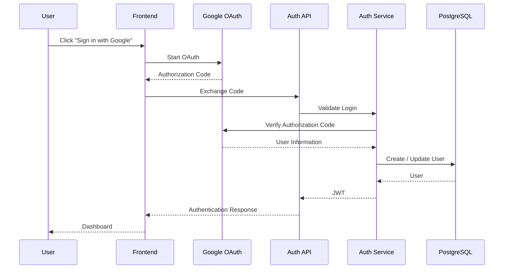

---

# 2. Resume Upload

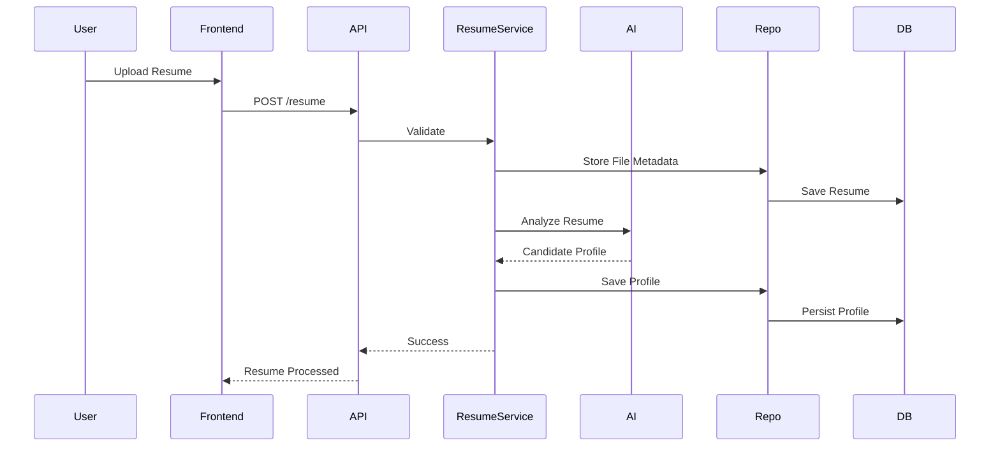

---

# 3. Interview Creation

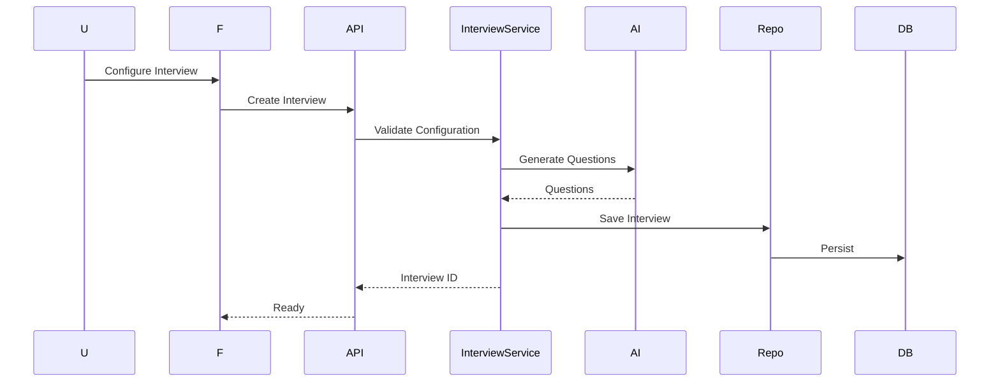

---

# 4. Interview Start

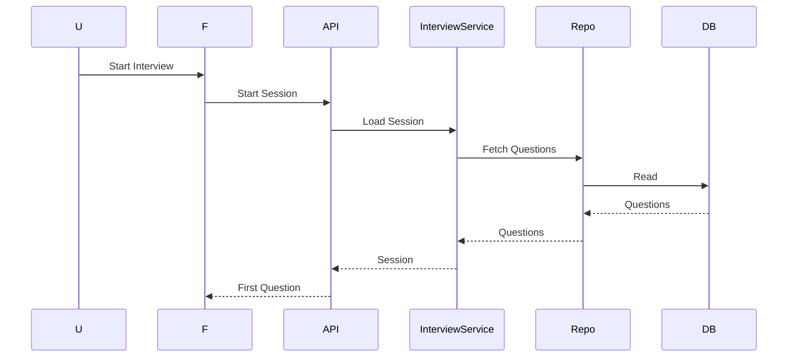

---

# 5. Submit Answer

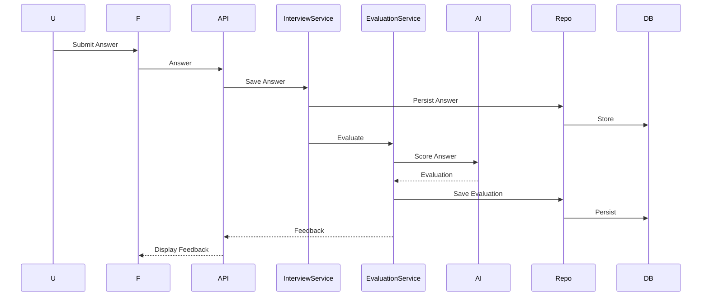

---

# 6. Voice Interview

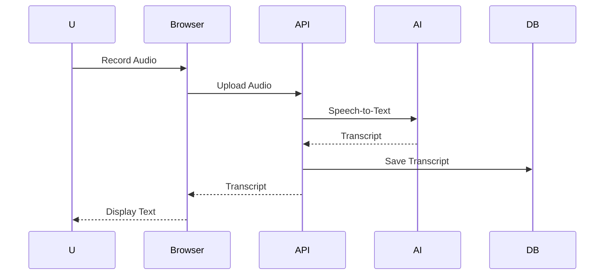

---

# 7. Interview Completion

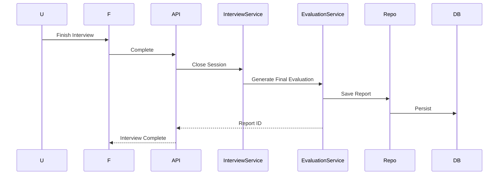

---

# 8. Report Generation

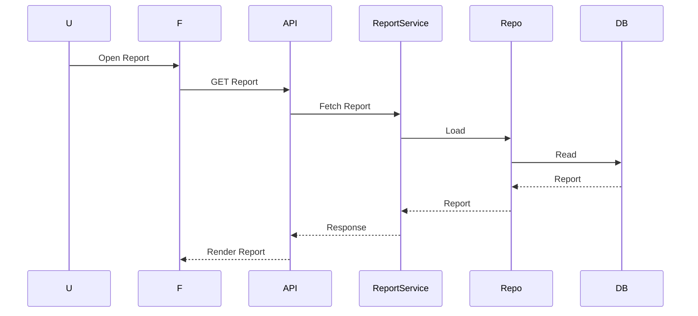

---

# 9. Dashboard Loading

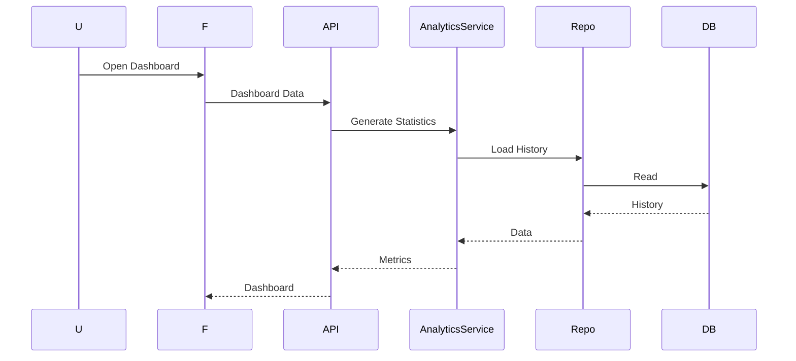

---

# 10. Logout

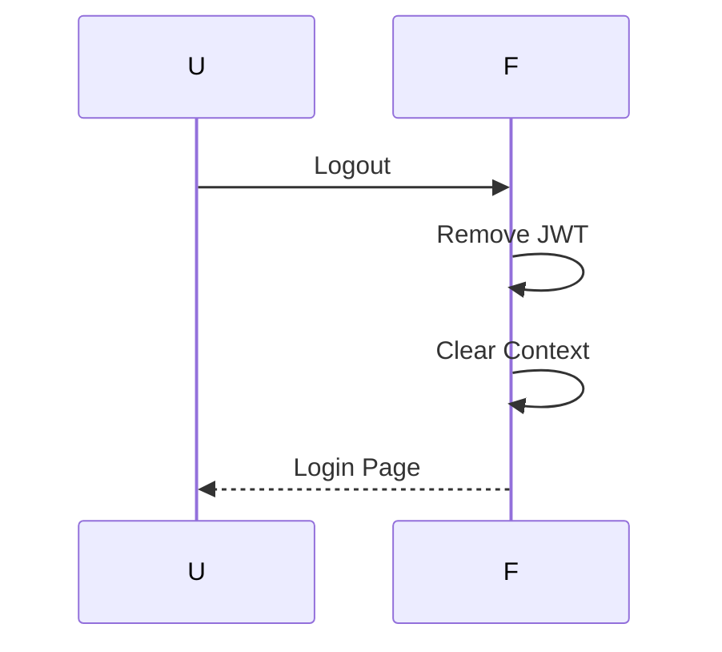

---

# Sequence Design Rules

Every workflow should:

- Validate input before processing.
- Enforce authentication where required.
- Keep business logic inside services.
- Persist state changes before responding.
- Return standardized API responses.

---

# Error Handling

Failures follow this interaction pattern:

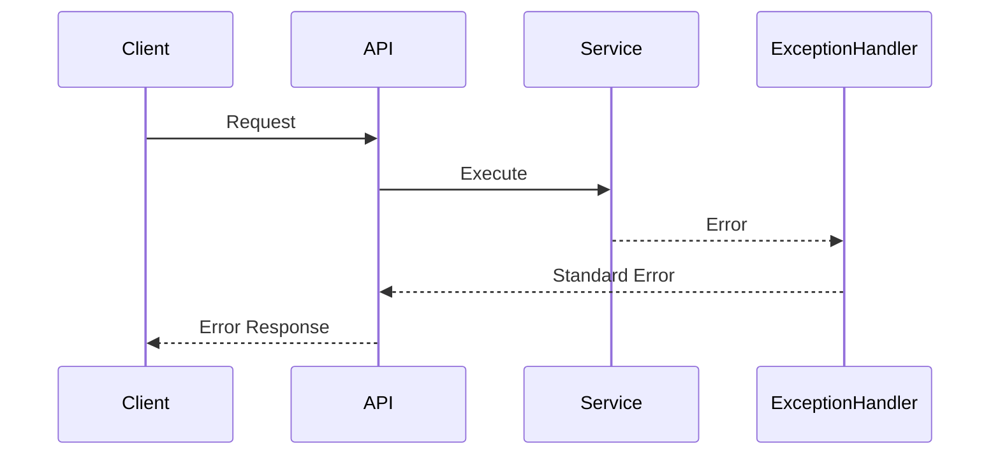

---

# Related Documents

- `system-overview.md`
- `data-flow.md`
- `backend-architecture.md`
- `ai-architecture.md`
- `deployment-architecture.md`

---

# Revision History

| Version | Date | Description |
|----------|------|-------------|
| 1.0.0 | 2026-07-23 | Initial sequence diagram specification |