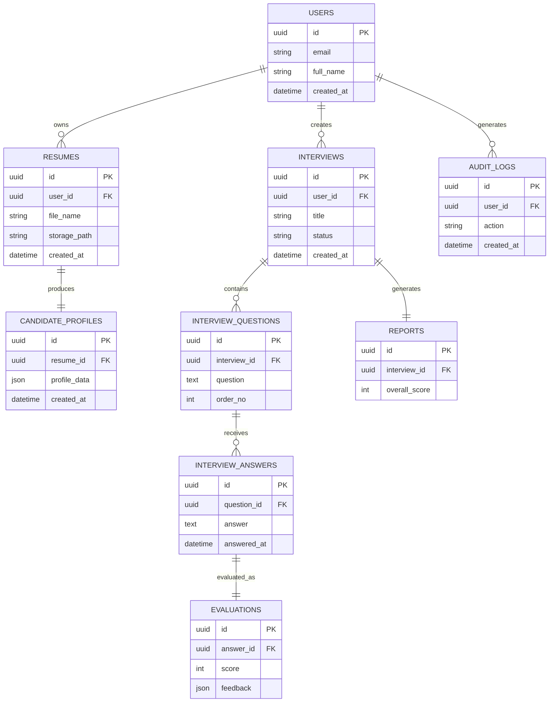

# Entity Relationship Diagram

**Document ID:** DB-002

**Version:** 1.0.0

**Status:** Approved

**Priority:** Critical

**Last Updated:** 2026-07-23

---

# Purpose

This document defines the Entity Relationship (ER) model for the AI Career
Interview Platform.

It describes:

- Business entities
- Relationships
- Cardinalities
- Referential integrity
- Cascade rules
- Ownership boundaries

This document is the authoritative reference for all entity relationships.

---

# Objectives

The ER model should be:

- Fully normalized
- Easy to understand
- Extensible
- Referentially consistent
- Business-oriented

---

# Complete ER Diagram



---

# Business Relationships

## User → Resume

Cardinality

```
One User

↓

Many Resumes
```

A user may upload multiple resumes.

Every resume belongs to exactly one user.

---

## Resume → Candidate Profile

Cardinality

```
One Resume

↓

One Candidate Profile
```

Every analyzed resume generates one structured candidate profile.

A profile cannot exist without its source resume.

---

## User → Interview

Cardinality

```
One User

↓

Many Interviews
```

A user may practice multiple interviews.

Each interview belongs to one user.

---

## Interview → Questions

Cardinality

```
One Interview

↓

Many Questions
```

Questions are generated specifically for an interview session.

Questions cannot exist independently.

---

## Question → Answer

Cardinality

```
One Question

↓

Many Answers (Future)

Version 1:

One Answer
```

Version 1 allows a single submitted answer.

Future versions may support retries and multiple attempts.

---

## Answer → Evaluation

Cardinality

```
One Answer

↓

One Evaluation
```

Every submitted answer produces exactly one AI evaluation.

---

## Interview → Report

Cardinality

```
One Interview

↓

One Report
```

The report summarizes the complete interview.

---

## User → Audit Log

Cardinality

```
One User

↓

Many Audit Events
```

Audit records capture significant user and system actions.

---

# Relationship Ownership

| Relationship | Owner |
|--------------|-------|
| User → Resume | Resume Service |
| Resume → Candidate Profile | AI Service |
| User → Interview | Interview Service |
| Interview → Question | Interview Service |
| Question → Answer | Interview Service |
| Answer → Evaluation | Evaluation Service |
| Interview → Report | Evaluation Service |
| User → Audit Log | Audit Service |

---

# Foreign Key Matrix

| Child Table | Parent Table | Foreign Key |
|--------------|--------------|-------------|
| resumes | users | user_id |
| candidate_profiles | resumes | resume_id |
| interviews | users | user_id |
| interview_questions | interviews | interview_id |
| interview_answers | interview_questions | question_id |
| evaluations | interview_answers | answer_id |
| reports | interviews | interview_id |
| audit_logs | users | user_id |

---

# Referential Integrity Rules

Every foreign key enforces:

- Existing parent record
- Matching UUID type
- Valid relationship
- Transaction consistency

Orphan records are not permitted.

---

# Delete Behavior

| Parent | Child | Action |
|---------|-------|--------|
| User | Resume | RESTRICT |
| Resume | Candidate Profile | CASCADE |
| User | Interview | RESTRICT |
| Interview | Questions | CASCADE |
| Question | Answers | CASCADE |
| Answer | Evaluation | CASCADE |
| Interview | Report | CASCADE |
| User | Audit Log | RESTRICT |

Business-critical data should not be deleted unintentionally.

---

# Update Behavior

Primary keys are immutable.

Foreign key updates are discouraged.

Business updates should occur through service-layer operations.

---

# Optional Relationships

Version 1 contains no optional business-critical relationships.

Future optional relationships may include:

- Job descriptions
- Organizations
- Certificates
- Practice sessions

---

# Lifecycle Dependencies

```text
User

↓

Resume

↓

Candidate Profile

↓

Interview

↓

Question

↓

Answer

↓

Evaluation

↓

Report
```

Each stage depends on successful completion of the previous stage.

---

# Relationship Design Principles

- One source of truth per entity
- Explicit foreign keys
- No circular dependencies
- Cascade only where safe
- Business ownership remains clear

---

# Future Expansion

Potential future entities:

```text
JOB_DESCRIPTIONS

SKILL_ASSESSMENTS

NOTIFICATIONS

ACHIEVEMENTS

CERTIFICATES

SUBSCRIPTIONS

ORGANIZATIONS
```

These should integrate through explicit foreign key relationships.

---

# Related Documents

- `schema-overview.md`
- `relationships.md`
- `constraints.md`
- `indexes.md`
- `entities/`

---

# Revision History

| Version | Date | Description |
|----------|------|-------------|
| 1.0.0 | 2026-07-23 | Initial ER diagram specification |