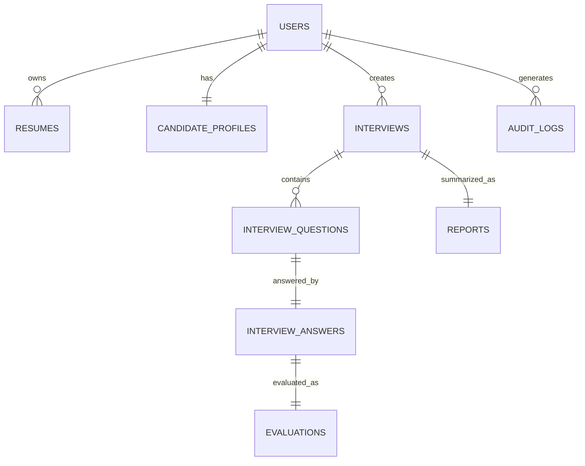

# Database Relationships

**Document ID:** DB-004

**Version:** 1.0.0

**Status:** Approved

**Priority:** Critical

**Last Updated:** 2026-07-23

---

# Purpose

This document defines every relationship within the AI Career Interview Platform database.

It specifies:

- Entity ownership
- Cardinality
- Foreign keys
- Cascade policies
- Referential integrity
- Delete behavior
- Update behavior
- Transaction boundaries

This document is the source of truth for database relationships.

---

# Relationship Overview

| Parent | Child | Type |
|---------|-------|------|
| Users | Resumes | One-to-Many |
| Users | Candidate Profiles | One-to-One |
| Users | Interviews | One-to-Many |
| Users | Audit Logs | One-to-Many |
| Interviews | Interview Questions | One-to-Many |
| Interview Questions | Interview Answers | One-to-One |
| Interview Answers | Evaluations | One-to-One |
| Interviews | Reports | One-to-One |

---

# Relationship Diagram



---

# Entity Ownership

## Users

Owns:

- Resumes
- Candidate Profile
- Interviews
- Audit Logs

Deleting a user affects all owned entities according to the cascade policy.

---

## Resumes

Owned exclusively by one user.

Cannot exist without a valid user.

---

## Candidate Profiles

Exactly one profile belongs to one user.

A user may have zero or one profile.

---

## Interviews

Each interview belongs to one user.

Owns:

- Questions
- Report

Indirectly owns:

- Answers
- Evaluations

---

## Interview Questions

Each question belongs to one interview.

Cannot exist independently.

---

## Interview Answers

Each answer belongs to one question.

Version 1 allows only one answer per question.

---

## Evaluations

Each evaluation belongs to one answer.

Cannot exist independently.

---

## Reports

Each report belongs to one interview.

Generated after evaluation completes.

---

## Audit Logs

Audit records optionally reference one user.

System events may not have an associated user.

Audit records never own other entities.

---

# Relationship Details

---

## Users → Resumes

Relationship

```
One User

↓

Many Resumes
```

Foreign Key

```
resumes.user_id

↓

users.id
```

Delete Policy

```
ON DELETE CASCADE
```

Reason

User-owned data should be removed during account deletion.

---

## Users → Candidate Profile

Relationship

```
One User

↓

One Candidate Profile
```

Foreign Key

```
candidate_profiles.user_id
```

Delete Policy

```
ON DELETE CASCADE
```

---

## Users → Interviews

Relationship

```
One User

↓

Many Interviews
```

Delete Policy

```
ON DELETE CASCADE
```

---

## Users → Audit Logs

Relationship

```
One User

↓

Many Audit Logs
```

Delete Policy

```
ON DELETE SET NULL
```

Reason

Audit history should survive account deletion.

---

## Interviews → Questions

Relationship

```
One Interview

↓

Many Questions
```

Delete Policy

```
ON DELETE CASCADE
```

---

## Questions → Answers

Relationship

```
One Question

↓

One Answer
```

Delete Policy

```
ON DELETE CASCADE
```

Future versions may support:

```
One Question

↓

Many Answers
```

---

## Answers → Evaluations

Relationship

```
One Answer

↓

One Evaluation
```

Delete Policy

```
ON DELETE CASCADE
```

---

## Interviews → Reports

Relationship

```
One Interview

↓

One Report
```

Delete Policy

```
ON DELETE CASCADE
```

---

# Cascade Matrix

| Parent | Child | Delete Policy |
|---------|-------|---------------|
| Users | Resumes | CASCADE |
| Users | Candidate Profiles | CASCADE |
| Users | Interviews | CASCADE |
| Users | Audit Logs | SET NULL |
| Interviews | Questions | CASCADE |
| Questions | Answers | CASCADE |
| Answers | Evaluations | CASCADE |
| Interviews | Reports | CASCADE |

---

# Referential Integrity Rules

Every foreign key must reference an existing parent record.

Orphan records are prohibited.

Database constraints enforce integrity.

Applications must never bypass foreign key validation.

---

# Update Policies

Primary keys are immutable.

Foreign keys may only change when explicitly supported by business rules.

Changing ownership is prohibited for:

- Interviews
- Reports
- Evaluations

Resume ownership transfer is also prohibited.

---

# Transaction Boundaries

## Interview Creation

Single transaction:

- Create interview
- Generate questions
- Persist questions

Commit only after all records succeed.

---

## Interview Completion

Single transaction:

- Save final answer
- Generate evaluation(s)
- Generate report

Rollback if any critical step fails.

---

## Resume Upload

Single transaction:

- Save resume metadata
- Save parsed information
- Update candidate profile

---

# Future Relationships

Potential additions:

- Skills ↔ Questions (Many-to-Many)
- Companies ↔ Interviews
- Recruiters ↔ Reports
- Learning Resources ↔ Weaknesses
- Tags ↔ Questions
- Topics ↔ Evaluations

---

# Relationship Design Principles

- Strong referential integrity
- Explicit ownership
- Minimal nullable foreign keys
- Predictable cascade behavior
- Immutable ownership
- Database-enforced consistency

---

# Related Documents

- `schema-overview.md`
- `er-diagram.md`
- `entities/users.md`
- `entities/interviews.md`
- `constraints.md`

---

# Revision History

| Version | Date | Description |
|----------|------|-------------|
| 1.0.0 | 2026-07-23 | Initial database relationship specification |