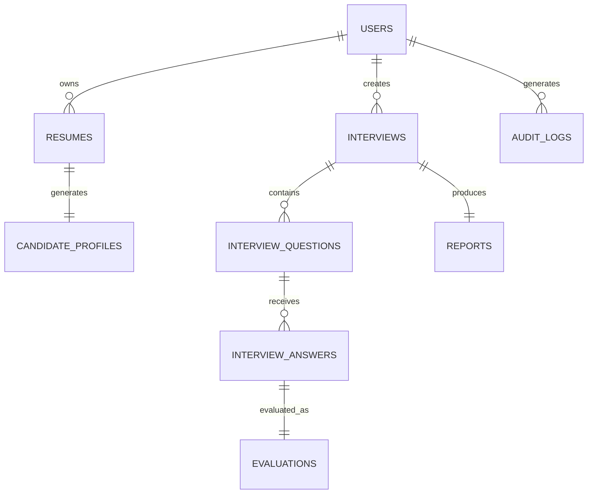

# Schema Overview

**Document ID:** DB-001

**Version:** 1.0.0

**Status:** Approved

**Priority:** Critical

**Last Updated:** 2026-07-23

---

# Purpose

This document defines the logical database schema for the AI Career Interview
Platform.

It introduces the major business entities, ownership boundaries, relationships,
naming conventions, lifecycle states, audit strategy, and database organization.

This document should be read before reviewing individual table definitions.

---

# Objectives

The schema should be:

- Fully normalized
- Easy to understand
- Extensible
- Secure
- Consistent
- High performance
- Migration friendly

---

# Database Technology

| Component | Technology |
|-----------|------------|
| Database | PostgreSQL |
| ORM | SQLAlchemy |
| Migration Tool | Alembic |

---

# Schema Philosophy

The database is organized around business domains rather than technical
concerns.

Each entity has:

- One owner
- One responsibility
- One lifecycle
- Explicit relationships
- Clear constraints

No table should contain unrelated business concepts.

---

# High-Level Domain Model

```text
Authentication
│
└── Users

Resume Domain
│
├── Resumes
└── Candidate Profiles

Interview Domain
│
├── Interviews
├── Interview Questions
└── Interview Answers

Evaluation Domain
│
├── Evaluations
└── Reports

Audit Domain
│
└── Audit Logs
```

---

# Logical Entity Map



---

# Core Business Domains

## Authentication

Responsible for:

- User identity
- Google OAuth information
- Login metadata

Primary Entity:

```
users
```

---

## Resume Domain

Responsible for:

- Resume metadata
- Resume storage references
- Candidate profile generation

Entities:

```
resumes

candidate_profiles
```

---

## Interview Domain

Responsible for:

- Interview sessions
- Generated questions
- Candidate answers

Entities:

```
interviews

interview_questions

interview_answers
```

---

## Evaluation Domain

Responsible for:

- AI evaluations
- Scores
- Recommendations
- Reports

Entities:

```
evaluations

reports
```

---

## Audit Domain

Responsible for:

- System auditing
- Security events
- Operational history

Entity:

```
audit_logs
```

---

# Entity Ownership

| Entity | Owner |
|---------|-------|
| Users | User Service |
| Resumes | Resume Service |
| Candidate Profiles | AI Service |
| Interviews | Interview Service |
| Interview Questions | Interview Service |
| Interview Answers | Interview Service |
| Evaluations | Evaluation Service |
| Reports | Evaluation Service |
| Audit Logs | Audit Service |

Ownership determines which service may modify the entity.

---

# Primary Keys

Every table uses:

```
UUID

Primary Key

id
```

Benefits:

- Globally unique
- Safer distributed systems
- Easier external references
- Avoid sequential identifier exposure

---

# Foreign Keys

Foreign keys always reference UUID primary keys.

Examples:

```
user_id

resume_id

interview_id

question_id

answer_id
```

Foreign key constraints are mandatory unless explicitly documented otherwise.

---

# Audit Columns

Every business table includes:

```
id

created_at

updated_at
```

Optional:

```
deleted_at

created_by

updated_by
```

Soft-delete support is implemented only where business requirements justify it.

---

# Lifecycle States

Example interview lifecycle:

```text
CREATED

↓

READY

↓

IN_PROGRESS

↓

COMPLETED

↓

ARCHIVED
```

State transitions are enforced in the service layer.

---

# Data Relationships

One User

↓

Many Resumes

↓

One Candidate Profile

↓

Many Interviews

↓

Many Questions

↓

Many Answers

↓

Many Evaluations

↓

One Report

---

# Normalization Strategy

The schema targets Third Normal Form (3NF).

Normalization goals:

- Eliminate duplication
- Preserve integrity
- Reduce update anomalies
- Improve maintainability

Controlled denormalization may be introduced for measured performance gains.

---

# Naming Conventions

Tables:

```
snake_case

plural nouns
```

Examples:

```
users

candidate_profiles

interview_answers
```

Columns:

```
snake_case
```

Examples:

```
created_at

updated_at

user_id
```

Constraints:

```
pk_

fk_

uq_

chk_
```

Indexes:

```
idx_
```

---

# Soft Delete Policy

Default behavior:

Hard delete.

Soft delete applies only where historical recovery is required.

Soft-deleted records remain excluded from normal application queries.

---

# Data Integrity

Integrity is enforced using:

- Primary keys
- Foreign keys
- Unique constraints
- Check constraints
- Transactions
- Application validation

The database should reject invalid states whenever possible.

---

# Schema Evolution

Every schema modification requires:

- Alembic migration
- Documentation update
- Backward compatibility review
- Performance review

Manual production schema changes are prohibited.

---

# Performance Considerations

Performance optimization includes:

- Proper indexing
- Efficient relationships
- Minimal redundancy
- Query optimization
- Connection pooling

Premature denormalization should be avoided.

---

# Security

Sensitive information should never be stored in plaintext.

Examples:

- OAuth secrets
- API keys
- Session secrets

Personally identifiable information (PII) should be stored only when required.

---

# Future Expansion

Future entities may include:

```
notifications

job_descriptions

practice_sessions

certificates

achievements

organizations

subscriptions
```

New entities should follow existing conventions.

---

# Related Documents

- `README.md`
- `er-diagram.md`
- `relationships.md`
- `constraints.md`
- `indexes.md`

---

# Revision History

| Version | Date | Description |
|----------|------|-------------|
| 1.0.0 | 2026-07-23 | Initial logical schema overview |